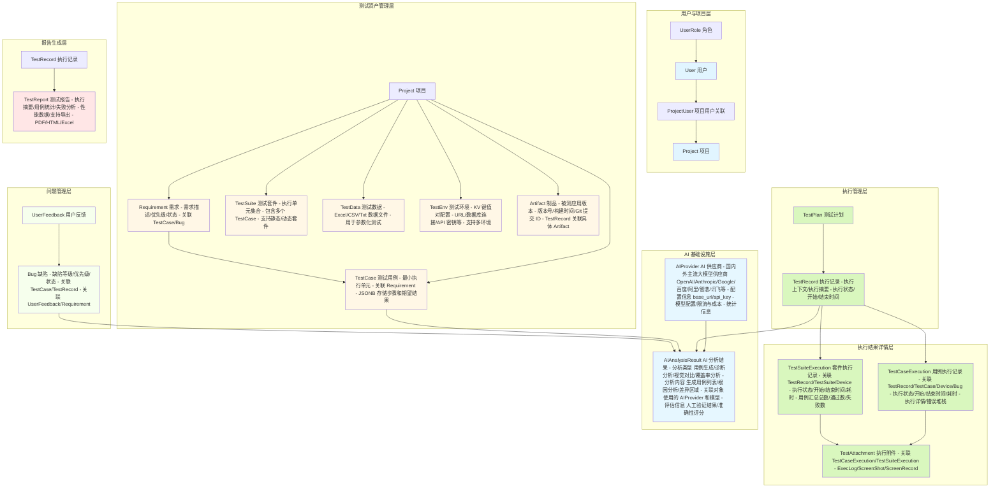

# Vibe Testing 自动化测试平台

## 项目概述

### 1.1 背景与目标

随着移动互联网的快速发展，企业面临着多端、多平台、多机型的测试挑战。传统的手工测试方式已无法满足快速迭代的交付需求，建设一套统一的自动化测试平台成为必然选择。本平台旨在构建一个覆盖 **前端、服务端、移动端、桌面端、硬件端** 的全栈自动化测试解决方案，通过统一的任务调度、结果分析和报告输出，显著提升测试效率与质量。

平台的核心价值主张体现在四个维度：
- **多端统一接入**，通过多框架桌面客户端和丰富的设备池支持，实现 Web、移动端、桌面端、AR/VR 设备、硬件设备的一站式测试管理；
- **AI Native 智能化**，引入大语言模型和计算机视觉技术，实现测试用例智能生成、测试结果智能诊断、性能瓶颈自动识别；
- **硬件在环测试**，通过 ESP32 硬件控制器实现软硬件协同测试，支持 IoT 设备、物理按键模拟、传感器数据采集等场景；
- **弹性资源扩展**，通过分布式执行架构和桌面客户端代理能力，充分利用企业现有计算资源，实现"众筹式"的测试能力扩展。

### 1.2 适用范围

本平台的设计目标是支持以下测试场景的全流程自动化：

**被测对象范围**涵盖公司所有核心业务系统的客户端产品，包括：
- **移动端原生应用**：Android Native、iOS Native、React Native、Flutter、AR/VR 应用（支持 Glass 智能眼镜）
- **桌面客户端应用**：Windows、macOS、Linux（支持 Electron、Wails、Tauri 多框架）
- **Web 端应用**：PC 浏览器、移动端浏览器
- **IoT/硬件设备**：基于 ESP32 的硬件设备、智能硬件产品

**测试类型覆盖**包括功能测试、UI 自动化测试、性能测试、兼容性测试、接口测试、**硬件在环测试（HIL）**、**AR/VR 界面测试**、**AI 模型测试**等核心测试类别。平台将提供丰富的测试框架集成能力，支持主流测试框架的无缝接入，如 Appium、Selenium、Playwright、Pytest 等，确保测试脚本的可移植性和技术栈的灵活性。

**AI Native 能力**涵盖测试用例智能生成、测试脚本自然语言编写、测试结果智能诊断、视觉回归测试自动识别、性能异常自动检测、测试知识图谱问答等场景。

---

## 二、系统架构设计

### 2.1 整体架构图

```mermaid
graph TB
    subgraph UserAccessLayer["用户访问层"]
        WebFrontend["Web 前端 - React Vue"]
        DesktopClient["桌面客户端 - Electron Wails Tauri"]
        MobileAPP["移动端 APP - 测试管理终端"]
    end

    subgraph APIGatewayLayer["API 网关层"]
        APISIX["APISIX 网关 - 认证授权 限流熔断 负载均衡 动态路由 插件扩展 gRPC 支持"]
    end

    subgraph BusinessServiceLayer["业务服务层"]
        UserService["用户服务"]
        ProjectService["项目服务"]
        TaskService["任务服务"]
        ReportService["报告服务"]
        DeviceService["设备服务"]
        DataService["数据服务"]
        MsgService["消息服务"]
        PlanService["测试计划服务"]
        CaseService["测试用例服务"]
        RecordService["测试记录服务"]
        AIService["AI 服务"]
    end

    subgraph InfrastructureLayer["基础设施层"]
        RabbitMQ["消息队列 - RabbitMQ"]
        Redis["缓存服务 - Redis"]
        MinIO["文件存储 - MinIO S3"]
        InfluxDB["时序数据库 - InfluxDB"]
        PostgreSQL["关系数据库 - PostgreSQL"]
        Nacos["注册中心 - Nacos"]
    end

    subgraph AIInfrastructureLayer["AI 基础设施层"]
        GpuCluster["GPU 计算集群 - PyTorch TF"]
        VectorDB["向量数据库 - Milvus"]
        ModelService["模型服务 - LLM VLM - 测试生成 智能诊断"]
    end

    subgraph ExecutionAgentLayer["执行代理层"]
        DesktopNode["桌面客户端节点 - Windows macOS Linux - 测试脚本引擎 设备连接管理器 - 图像识别引擎 CV OCR - 性能监控采集器"]
        MobileDevicePool["移动设备池 - Android iOS Glass - 智能眼镜 AR VR 界面测试 - Android 设备群 iOS 设备群"]
        HardwareNode["硬件测试节点 - ESP32 硬件控制器 - GPIO 控制 传感器读取 - 串口通信 蓝牙 WiFi - 硬件触发 状态反馈"]
    end

    WebFrontend --> APISIX
    DesktopClient --> APISIX
    MobileAPP --> APISIX

    APISIX --> UserService
    APISIX --> ProjectService
    APISIX --> TaskService
    APISIX --> ReportService
    APISIX --> DeviceService
    APISIX --> DataService
    APISIX --> MsgService
    APISIX --> PlanService
    APISIX --> CaseService
    APISIX --> RecordService
    APISIX --> AIService

    UserService --> RabbitMQ
    ProjectService --> RabbitMQ
    TaskService --> RabbitMQ
    ReportService --> RabbitMQ
    DeviceService --> RabbitMQ
    DataService --> RabbitMQ
    MsgService --> RabbitMQ
    PlanService --> RabbitMQ
    CaseService --> RabbitMQ
    RecordService --> RabbitMQ
    AIService --> RabbitMQ

    UserService --> Redis
    ProjectService --> Redis
    TaskService --> Redis
    ReportService --> Redis
    DeviceService --> Redis
    DataService --> Redis
    MsgService --> Redis
    PlanService --> Redis
    CaseService --> Redis
    RecordService --> Redis
    AIService --> Redis

    RecordService --> InfluxDB
    DeviceService --> InfluxDB

    UserService --> PostgreSQL
    ProjectService --> PostgreSQL
    TaskService --> PostgreSQL
    ReportService --> PostgreSQL
    DeviceService --> PostgreSQL
    DataService --> PostgreSQL
    MsgService --> PostgreSQL
    PlanService --> PostgreSQL
    CaseService --> PostgreSQL
    RecordService --> PostgreSQL
    AIService --> PostgreSQL

    UserService --> Nacos
    ProjectService --> Nacos
    TaskService --> Nacos
    ReportService --> Nacos
    DeviceService --> Nacos
    DataService --> Nacos
    MsgService --> Nacos
    PlanService --> Nacos
    CaseService --> Nacos
    RecordService --> Nacos
    AIService --> Nacos

    AIService --> GpuCluster
    AIService --> VectorDB
    AIService --> ModelService

    TaskService --> DesktopNode
    TaskService --> MobileDevicePool
    TaskService --> HardwareNode

    DataService --> MinIO
    RecordService --> MinIO
```



### 2.3 API 网关层

API 网关层采用 **Apache APISIX** 作为统一的 API 网关方案，基于 etcd + lua-nginx-module 构建，提供动态路由、热更新、插件扩展等能力。

**APISIX 网关定位**作为新一代云原生 API 网关，负责处理所有外部和内部的 API 请求，完成认证授权、限流熔断、日志审计、动态路由、协议转换等横切关注点的统一处理。其核心优势包括：

- **动态路由**：支持基于 etcd 的配置热更新，无需重启网关即可实现路由规则的动态调整
- **原生 gRPC 支持**：支持 gRPC 代理和协议转换，满足高性能 gRPC 通信需求
- **插件扩展**：丰富的插件生态，支持自定义插件开发，覆盖 JWT 认证、OAuth 2.0、IP 限流、请求转发等场景
- **高性能**：基于 Nginx 的高性能处理能力，支持高并发请求处理
- **云原生架构**：控制平面与数据平面分离，便于实现多集群部署和跨地域流量调度
- **协议转换**：支持 HTTP/HTTPS、WebSocket、gRPC、Dubbo 等多种协议的转换和适配

**网关核心能力**包括：
- **认证授权**：统一对接 SSO、OAuth 2.0、JWT、LDAP 等认证方式，实现细粒度的 API 访问控制
- **限流熔断**：支持基于令牌桶、滑动窗口的限流算法，配合熔断机制保护后端服务
- **协议转换**：支持 HTTP/HTTPS、WebSocket、gRPC、Dubbo 等多种协议的转换和适配
- **负载均衡**：支持轮询、加权轮询、最少连接等负载均衡策略，配合健康检查实现故障转移
- **日志审计**：记录完整的请求响应日志，支持日志脱敏和敏感信息保护

### 2.4 架构设计原则

本平台采用微服务架构作为基础架构范式，这一选择基于以下技术考量：微服务架构能够实现各服务模块的独立部署和弹性伸缩，有效支撑测试任务的高峰期资源调配需求；同时，服务边界的清晰划分也有利于团队按职责进行并行开发和维护，降低系统整体的维护成本。

**松耦合高内聚原则**贯穿整个系统设计。服务之间通过定义良好的 API 接口进行通信，内部实现细节对外部透明。这种设计使得任何一个服务模块的升级或重构都不会影响到其他模块的正常运行。在具体实现中，我们采用事件驱动模式处理服务间的异步通信，通过消息队列实现任务的可靠投递和消费的幂等性保障。

**可观测性原则**要求所有服务模块都必须输出标准化的日志、指标和追踪数据。日志采用结构化的 JSON 格式，包含请求链路 ID、服务实例标识、时间戳、日志级别等标准字段；指标数据通过 Prometheus 协议暴露，由统一的监控平台进行采集和告警；分布式追踪采用 OpenTelemetry 标准，确保跨服务调用链路的完整可见性。

---

## 三、后端服务设计

### 3.1 服务拆分与职责

后端系统按照业务领域划分为六个核心微服务，每个服务承担明确的职责边界，通过注册中心实现服务发现和配置管理。

**用户与权限服务（User Service）**负责平台的用户认证、授权和权限管理。该服务实现了基于 RBAC（基于角色的访问控制）的权限模型，支持细粒度的资源权限配置，包括测试项目的管理权限、测试脚本的执行权限、设备的使用权限等。在认证机制上，服务支持多种登录方式的集成，包括企业 SSO 单点登录、LDAP 目录服务集成以及传统的用户名密码认证，确保能够适配不同企业的身份管理体系。

**项目管理服务（Project Service）**是测试资产管理的核心模块，负责测试项目、测试用例、测试套件的全生命周期管理。项目概念对应被测应用的业务单元，每个项目下可以管理多版本的测试用例，支持用例的草稿、发布、废弃等状态流转。测试用例采用结构化的数据模型设计，包含基本信息（标题、描述、优先级）、前置条件、执行步骤、预期结果、标签分类等完整字段，同时支持附件上传（截图、视频、文档）和执行历史追溯。

**任务调度服务（Task Service）**是平台的执行引擎核心，负责任务的创建、调度、执行和状态管理。该服务集成了分布式任务调度框架，支持定时任务、触发式任务、并行任务、任务依赖等多种执行模式。任务调度的策略设计考虑到了资源利用率和执行效率的平衡，通过智能的资源分配算法，在保证任务按时执行的前提下，最大化利用有限的测试设备资源。服务还实现了任务的重试机制、超时控制和熔断保护，确保异常情况下系统的稳定性。

**设备管理服务（Device Service）**提供设备资源的统一接入、状态监控和调度控制。该服务支持多类型设备的接入，包括 Android 设备（通过 ADB 连接）、iOS 设备（通过 Xcode 或 libimobiledvice）、桌面代理节点（通过 WebSocket 长连接）。设备池的管理实现了设备在线状态、忙碌状态、维护状态、故障状态的自动流转，配合健康检查机制，确保设备资源的可用性感知。设备分配采用竞速策略，支持按机型、系统版本、屏幕尺寸等维度进行亲和性调度。

**测试执行服务（Execution Service）**是测试脚本的实际执行引擎，负责与各类型测试框架的对接和测试过程的监控。该服务运行在代理节点上，与后端服务通过消息队列进行通信。执行服务接收测试任务后，下载对应的测试脚本和配置，在本地环境中初始化测试上下文，然后驱动被测应用执行预定义的测试步骤。执行过程中，服务实时采集测试日志、设备状态、性能指标，并通过流式推送的方式同步到后端，实现测试进度的实时可见。

**报告分析服务（Report Service）**负责测试结果的聚合、分析和报告生成。服务接收测试执行完成后上报的结果数据，进行结构化存储和索引构建。报告生成模块支持多种维度的分析视图，包括项目维度的通过率趋势、用例维度的失败分布、执行维度的资源消耗等。智能分析引擎能够识别测试结果中的异常模式，如频繁失败的用例、性能劣化趋势、错误类型的聚类等，为测试团队提供可执行的优化建议。

**测试计划服务（Plan Service）**负责测试计划的全生命周期管理，包括测试计划的创建、审批、执行监控和结果汇总。测试计划是连接测试用例与测试执行的桥梁，支持按项目、版本、模块等维度组织测试用例，形成完整的测试覆盖策略。服务支持手动创建计划和智能生成计划两种方式：手动创建允许用户通过界面或 API 灵活配置测试范围；智能生成基于 AI 模型分析代码变更、历史缺陷、风险区域，自动推荐需要覆盖的测试用例。测试计划支持多阶段执行配置，如冒烟测试阶段、回归测试阶段、全量测试阶段等。

**测试用例服务（Case Service）**负责测试用例的标准化管理与智能增强。服务采用结构化的数据模型存储用例信息，包括基本信息（标题、描述、优先级、所属模块）、前置条件、执行步骤、预期结果、标签分类、关联需求等完整字段。用例版本管理支持完整的变更历史追溯，确保用例演进的可审计性。AI 能力增强体现在三个方面：用例智能生成（基于自然语言描述或需求文档自动生成测试用例）、用例去重分析（基于语义相似度识别重复或相似的用例）、用例覆盖率分析（基于代码调用链和需求追踪矩阵计算用例覆盖率）。

**测试记录服务（Record Service）**负责测试执行过程的全链路记录与追溯。服务采集测试过程中的各类数据，包括执行日志、设备状态、性能指标、截图录像、错误堆栈、API 响应等，形成完整的测试执行档案。测试记录与测试计划、用例形成关联，支持按计划维度、用例维度、时间维度等多角度查询和统计。智能分析功能能够从海量记录中识别异常模式，如 flaky test 识别、性能劣化趋势、关联失败检测等，为测试团队提供可执行的优化建议。

### 3.2 技术选型建议

后端服务的技术栈选择遵循成熟稳定、生态丰富、性能优异的原则。编程语言统一采用 **Go** 语言开发，利用其优秀的并发处理能力、低内存占用、快速编译和部署的优势，满足平台对高性能和高并发的要求。Go 语言的原生并发模型（goroutine）和丰富的标准库，使得服务端开发更加高效和稳定。

**核心依赖组件**的选型如下：
- **微服务框架**：采用 **Go-Zero** 微服务框架，基于 Go 语言构建，提供服务注册发现、RPC 通信、负载均衡、熔断降级、链路追踪等完整的微服务治理能力。Go-Zero 集成了丰富的工具链，包括代码生成工具（protoc、goctl）、API 文档自动生成、性能分析工具等，大幅提升开发效率。
- **服务注册与配置中心**：采用 **Nacos** 作为服务注册中心和配置中心，提供服务发现、健康检查、动态配置管理等功能。Nacos 支持 CP 和 AP 两种模式，可根据业务需求选择合适的部署模式。
- **消息队列**：采用 **RabbitMQ** 作为消息中间件，支持多种消息协议（AMQP、MQTT、STOMP），提供可靠的消息投递和消息确认机制。RabbitMQ 的集群部署模式支持高可用和负载均衡，确保测试任务投递的准确性和可靠性。
- **关系数据库**：采用 **PostgreSQL** 作为关系数据库，其强大的 JSONB 数据类型和丰富的数据类型支持，非常适合存储结构化的测试用例数据、复杂的查询需求和全文检索。PostgreSQL 的 MVCC 机制和高性能特性，满足平台对数据一致性和高并发的要求。
- **时序数据库**：采用 **InfluxDB** 作为时序数据库，专门用于存储性能指标、监控数据等时间序列数据。InfluxDB 提供高效的写入和查询性能，支持数据压缩和保留策略，适合存储海量的时序监控数据。
- **缓存层**：采用 **Redis Cluster** 作为缓存层，提供高速的会话缓存和热点数据缓存。Redis 支持多种数据结构（String、Hash、List、Set、ZSet），可用于缓存用户会话、设备状态、测试结果等数据。Redis Cluster 提供数据分片和高可用，支持自动故障转移。
- **对象存储**：采用 **MinIO** 作为对象存储服务，兼容 AWS S3 API 协议，提供高性能的文件存储和检索能力。MinIO 支持分布式部署、数据加密、版本控制、生命周期管理等高级特性，适合存储测试报告、截图、视频等大体积附件。
- **向量数据库**：采用 **Milvus** 作为向量数据库，用于存储和检索 AI 模型的向量表示。Milvus 支持海量向量数据的快速检索，支持多种索引类型（IVF_FLAT、IVF_SQ8、HNSW），满足 AI Native 能力的向量检索需求。
- **搜索服务**：采用 **Elasticsearch** 作为全文搜索引擎，用于测试用例、缺陷、需求等数据的全文检索。Elasticsearch 提供强大的搜索和分析能力，支持多语言分词、模糊搜索、聚合查询等特性，提升数据检索的效率。

**服务拆分与职责**：
- **用户服务（User Service）**：负责用户认证、授权和权限管理，实现基于 RBAC 的权限模型，支持多种登录方式（企业 SSO、LDAP、用户名密码）。
- **项目管理服务（Project Service）**：负责测试项目、测试用例、测试套件的全生命周期管理，支持用例的版本管理和变更追溯。
- **任务调度服务（Task Service）**：负责任务的创建、调度、执行和状态管理，集成分布式任务调度框架，支持定时任务、触发式任务、并行任务、任务依赖等多种执行模式。
- **设备管理服务（Device Service）**：提供设备资源的统一接入、状态监控和调度控制，支持多类型设备的接入（Android、iOS、桌面代理、硬件设备）。
- **测试执行服务（Execution Service）**：是测试脚本的实际执行引擎，负责与各类型测试框架的对接和测试过程的监控，运行在代理节点上。
- **报告分析服务（Report Service）**：负责测试结果的聚合、分析和报告生成，支持多种维度的分析视图和报告格式。
- **测试计划服务（Plan Service）**：负责测试计划的全生命周期管理，支持手动创建和智能生成两种方式。
- **测试用例服务（Case Service）**：负责测试用例的标准化管理与智能增强，支持用例智能生成、去重分析、覆盖率分析。
- **测试记录服务（Record Service）**：负责测试执行过程的全链路记录与追溯，采集各类数据并形成完整的测试执行档案。
- **AI 服务（AI Service）**：负责 AI 能力的统一接入和管理，包括用例生成、结果诊断、视觉对比等，对接多个 AI Provider。
- **缺陷管理服务（Bug Service）**：负责缺陷的全生命周期管理，支持缺陷的创建、分配、修复、验证、关闭等流转。
- **需求管理服务（Requirement Service）**：负责需求的全生命周期管理，支持需求的创建、评审、开发、完成等状态流转。
- **用户反馈服务（Feedback Service）**：负责用户反馈的收集、处理和转换，支持快速转换为缺陷。

### 3.3 数据模型设计

```mermaid
erDiagram
    User ||--o{ ProjectUser : "项目用户关联"
    ProjectUser }o--|| Project : "项目"
    User ||--o{ UserRole : "角色"
    
    Project ||--o{ Requirement : "管理需求"
    Requirement ||--o{ TestCase : "生成测试用例"
    Requirement ||--o{ Bug : "缺陷追溯"
    
    Project ||--o{ TestCase : "管理测试用例"
    Project ||--o{ TestSuite : "管理测试套件"
    Project ||--o{ TestData : "配置测试数据"
    Project ||--o{ TestEnv : "配置测试环境"
    Project ||--o{ Artifact : "关联被测版本"
    Project ||--o{ UserFeedback : "收集用户反馈"
    
    TestCase ||--o{ TestSuite : "包含测试用例"}
    TestCase ||--o{ TestCaseExecution : "执行测试用例"}
    TestCase ||--o{ Bug : "失败产生缺陷"}
    
    UserFeedback }o--|| Bug : "快速转换为缺陷"
    Bug ||--o{ TestCaseExecution : "关联失败用例"
    Bug ||--o{ TestRecord : "关联执行记录"
    Bug ||--o{ Requirement : "关联需求"
    
    TestPlan ||--o{ TestCase : "包含测试用例集合"}
    TestPlan ||--o{ TestSuite : "包含测试套件集合"
    TestPlan ||--o{ TestData : "引用测试数据"
    TestPlan ||--o{ TestEnv : "引用测试环境"
    TestPlan ||--o{ Artifact : "关联制品"
    TestPlan ||--|| TestRecord : "执行生成执行记录"
    
    TestRecord ||--o{ TestCaseExecution : "包含用例执行记录"
    TestRecord ||--o{ TestSuiteExecution : "包含套件执行记录"
    TestRecord ||--|| TestReport : "生成测试报告"
    
    TestCaseExecution ||--o{ TestAttachment : "产生执行附件"
    TestSuiteExecution ||--o{ TestAttachment : "产生执行附件"
    
    AIProvider ||--o{ AIAnalysisResult : "提供AI服务"
    TestRecord ||--o{ AIAnalysisResult : "生成AI分析结果"}
    TestCase ||--o{ AIAnalysisResult : "生成AI分析结果"
    Bug ||--o{ AIAnalysisResult : "生成AI分析结果"
```



**核心表结构说明**：

---

### 一、用户与项目层

#### 1. users 用户表
存储平台用户的基本信息和认证凭据。
- **核心字段**：用户名、密码（加密）、邮箱、手机号、创建时间、最后登录时间、状态（正常/禁用）
- **扩展字段**：头像 URL、部门、职位、语言偏好、时区
- **安全字段**：两步验证密钥、密码盐值、登录失败次数、锁定时间

#### 2. user_roles 角色表
定义系统中的角色信息，用于 RBAC 权限控制。
- **核心字段**：角色名称、角色描述、权限列表（JSON）、创建时间、状态（启用/禁用）
- **系统预置角色**：超级管理员、项目管理员、测试工程师、只读用户
- **权限定义**：细粒度到 API 接口级别的权限控制

#### 3. project_users 项目用户关联表
存储用户与项目的关联关系，支持用户在项目中的角色定义。
- **核心字段**：项目 ID、用户 ID、角色、加入时间、状态（正常/移除）
- **角色定义**：项目负责人、测试负责人、开发者、观察者

#### 4. projects 项目表
存储测试项目的基本信息。
- **核心字段**：项目编码（业务主键）、项目名称、项目描述、创建者、创建时间、状态（正常/归档/删除）
- **配置字段**：项目图标、标签、Git 仓库地址、默认测试环境
- **统计字段**：用例总数、执行次数、最近执行时间

---

### 二、测试资产管理层

#### 5. requirements 需求表
存储项目需求的信息，实现需求到用例的追踪。
- **核心字段**：需求编号、需求标题、需求描述、优先级（P0/P1/P2/P3）、状态（待评审/已评审/开发中/已完成）、负责人、创建时间、预计完成时间、实际完成时间
- **关联字段**：关联项目 ID
- **版本管理**：版本号、变更历史（JSON）、父需求 ID（支持需求层级）
- **测试关联**：关联的 TestCase 集合（实现需求覆盖率）、关联的 Bug 集合（实现缺陷追溯）

#### 6. test_cases 测试用例表
存储单个测试用例的完整信息，是最小的执行单元。
- **核心字段**：用例编号、用例标题、用例描述、优先级（P0/P1/P2/P3）、用例类型（功能测试/性能测试/兼容性测试）、状态（草稿/已发布/已废弃）、创建者、创建时间、版本号
- **关联字段**：关联项目 ID、关联需求 ID（Requirement）
- **步骤数据**（JSONB 字段）：
  ```json
  {
    "preconditions": "前置条件描述",
    "steps": [
      {"order": 1, "action": "操作描述", "expected": "期望结果"},
      {"order": 2, "action": "操作描述", "expected": "期望结果"}
    ],
    "tags": ["冒烟测试", "回归测试"],
    "attachments": ["文件路径1", "文件路径2"]
  }
  ```
- **AI 增强字段**：智能分类、相似用例 ID 列表、推荐优先级、覆盖率评分
- **执行关联**：关联的 TestCaseExecution 记录集合

#### 7. test_suites 测试套件表
定义用例的组织结构，是执行单元的集合。
- **核心字段**：套件编号、套件名称、套件描述、套件类型（静态/动态）、状态（正常/禁用）、创建者、创建时间
- **关联字段**：关联项目 ID
- **套件内容**：
  - 静态套件：包含固定的 TestCase ID 列表
  - 动态套件：包含筛选条件（JSON），按标签、模块、优先级等筛选用例
- **执行策略**：并行度、超时时间（秒）、重试次数、失败继续执行标志
- **执行关联**：关联的 TestSuiteExecution 记录集合

#### 8. test_data 测试数据表
存储测试用例或套件所需的测试数据文件。
- **核心字段**：数据编号、数据名称、文件名称、文件类型（Excel/CSV/Txt/JSON）、文件大小（字节）、上传时间、上传者
- **关联字段**：关联项目 ID、关联用例 ID（可选）、关联套件 ID（可选）
- **存储字段**：文件路径（对象存储地址）、文件版本、校验和（MD5）
- **使用场景**：参数化测试、数据驱动测试

#### 9. test_env 测试环境表
存储测试环境的配置信息，采用 KV 键值对格式。
- **核心字段**：环境编号、环境名称、环境类型（开发/测试/预发布/生产）、状态（正常/维护/禁用）、创建者、创建时间
- **关联字段**：关联项目 ID
- **配置数据**（多条记录，每条一个键值对）：
  - 配置键：base_url、database_url、api_key 等
  - 配置值：具体配置内容
  - 加密标识：是否敏感信息（如密码）
- **环境变量**：环境变量列表（JSON）

#### 10. artifacts 制品表
存储被测应用的制品信息，标识每次测试执行的版本。
- **核心字段**：制品编号、制品名称、版本号、构建类型（Debug/Release）、构建时间、构建时长（秒）、Git 提交 ID、构建人
- **关联字段**：关联项目 ID
- **存储字段**：制品文件路径（对象存储地址）、文件大小、文件校验和（MD5/SHA256）
- **附加信息**：构建日志路径、发布说明、关联的需求 ID 列表
- **执行关联**：关联的 TestRecord 记录集合

---

### 三、问题管理层

#### 11. user_feedbacks 用户反馈表
存储来自用户渠道的反馈信息，支持快速转换为缺陷。
- **核心字段**：反馈编号、反馈标题、反馈内容、反馈渠道（应用内/客服工单/用户调研/邮件）、反馈人、发生时间、创建时间、状态（待处理/处理中/已转缺陷/已关闭）、处理人、关闭时间
- **关联字段**：关联项目 ID、关联 TestRecord（可选，便于定位问题）
- **设备信息**：设备型号、操作系统版本、应用版本
- **附件字段**：附件路径列表（JSON，包含日志、截图、录屏等）
- **转换信息**：关联的 Bug ID（已转换后）、转换时间、转换人

#### 12. bugs 缺陷表
存储测试发现的问题或由用户反馈转换而来的缺陷信息。
- **核心字段**：缺陷编号、缺陷标题、缺陷描述、缺陷等级（致命/严重/一般/轻微）、优先级（P0/P1/P2/P3）、缺陷状态（新建/已分配/已修复/已验证/已关闭/重复/不修复）、创建者、责任人、创建时间、修复时间、验证人、验证时间、关闭时间
- **关联字段**：关联项目 ID、关联 TestCase（可选）、关联 TestRecord（可选）、关联 UserFeedback（可选）、关联 Requirement（可选）
- **环境信息**：复现环境（开发/测试/预发布/生产）、设备信息、操作系统、浏览器信息
- **复现步骤**：前置条件、操作步骤、期望结果、实际结果（JSON 结构）
- **附件管理**：附件路径列表（JSON）、缺陷截图、日志文件、录屏视频
- **生命周期**：流转历史（JSON）、重复缺陷 ID 列表、关联缺陷 ID 列表（父子关系）

---

### 四、执行管理层

#### 13. test_plans 测试计划表
存储测试计划的完整信息，是用户创建的待执行任务定义。
- **核心字段**：计划编号、计划名称、计划类型（手动/智能生成）、关联项目 ID、创建者、创建时间、预期开始时间、预期结束时间、实际开始时间、实际结束时间、执行状态（待执行/进行中/已完成/已取消）、执行人
- **关联内容**（JSON 字段）：
  ```json
  {
    "test_cases": ["用例ID1", "用例ID2"],
    "test_suites": ["套件ID1", "套件ID2"],
    "test_data": "测试数据ID",
    "test_env": "测试环境ID",
    "artifact": "制品ID"
  }
  ```
- **执行策略**：触发方式（立即/定时/事件触发）、定时规则（Cron 表达式）、并行度、超时时间、重试次数
- **通知配置**：通知方式（邮件/钉钉/飞书）、通知时机（开始/完成/失败）
- **AI 生成**：AI 推荐理由、用例覆盖分析（JSON）

#### 14. test_records 执行记录表
存储测试执行的全链路记录，是测试计划执行完成后生成的记录。
- **核心字段**：记录编号、关联计划 ID（TestPlan）、关联项目 ID、执行人、开始时间、结束时间、执行时长（秒）、执行状态（进行中/成功/失败/超时/取消）
- **执行摘要**：
  - 总用例数、通过数、失败数、阻塞数、跳过数
  - 通过率（百分比）、执行成功率（百分比）
  - 总耗时、平均每用例耗时
- **执行上下文**（JSON 字段）：
  ```json
  {
    "environment": {
      "test_env_id": "环境ID",
      "env_name": "环境名称",
      "env_config": {...}
    },
    "artifact": {
      "artifact_id": "制品ID",
      "version": "版本号",
      "git_commit": "提交ID"
    },
    "devices": ["设备ID1", "设备ID2"]
  }
  ```
- **统计信息**：关联的 TestCaseExecution 数量、关联的 TestSuiteExecution 数量、关联的 Bug 数量
- **报告生成**：报告 URL、报告生成时间、报告格式（HTML/PDF/Excel）

#### 15. test_case_executions 用例执行记录表
存储每个 TestCase 在每次 TestRecord 执行中的详细结果。
- **核心字段**：执行编号、关联记录 ID（TestRecord）、关联用例 ID（TestCase）、设备 ID、执行状态（等待中/进行中/通过/失败/跳过/超时）、开始时间、结束时间、执行时长（秒）、执行人
- **执行详情**：
  - 错误堆栈（TEXT）、错误消息、失败原因
  - 执行步骤（JSON）：每个步骤的执行结果、耗时、截图
  - 性能指标（JSON）：CPU 使用率、内存占用、网络流量、响应时间
- **关联信息**：关联的 Bug ID（失败时自动创建或关联）、关联的 TestAttachment 记录集合
- **重试信息**：重试次数、重试历史（JSON）

#### 16. test_suite_executions 套件执行记录表
存储每个 TestSuite 在每次 TestRecord 执行中的详细结果。
- **核心字段**：执行编号、关联记录 ID（TestRecord）、关联套件 ID（TestSuite）、设备 ID、执行状态（等待中/进行中/通过/失败/跳过/超时）、开始时间、结束时间、执行时长（秒）、执行人
- **用例汇总**：
  - 总用例数、通过数、失败数、阻塞数、跳过数
  - 通过率（百分比）、执行成功率（百分比）
  - 平均每用例耗时
- **关联信息**：关联的 TestAttachment 记录集合
- **执行摘要**：执行摘要文本、关键失败用例列表（JSON）

---

### 五、执行附件层

#### 17. test_attachments 执行附件表
存储测试执行过程中产生的各类附件。
- **核心字段**：附件编号、关联执行类型（test_case_execution/test_suite_execution）、关联执行 ID、附件类型（log/screenshot/screenrecord/other）、文件名称、文件大小（字节）、文件路径（对象存储地址）、上传时间
- **类型特定字段**：
  - 日志（log）：日志级别、日志行数、开始时间、结束时间
  - 截图（screenshot）：截图时间、缩略图路径、截图尺寸（宽/高）
  - 录屏（screenrecord）：录制时长、视频格式、视频分辨率
- **关联信息**：创建者、上传节点（设备 ID）
- **元数据**：文件校验和（MD5）、附件标签（JSON）

---

### 六、报告生成层

#### 18. test_reports 测试报告表
存储生成的测试报告信息。
- **核心字段**：报告编号、关联记录 ID（TestRecord）、报告标题、报告类型（标准报告/摘要报告/失败分析报告）、报告格式（HTML/PDF/Excel）、生成时间、生成人
- **报告内容**（可选存储）：
  - HTML 报告内容（TEXT）
  - PDF 文件路径
  - Excel 文件路径
- **统计摘要**（JSON）：执行摘要、用例统计、失败分析、性能趋势
- **分享信息**：分享链接、分享有效期、访问次数
- **历史版本**：关联的旧报告 ID（支持报告版本对比）

---

### 七、AI 基础设施层

#### 20. ai_providers AI 供应商表
存储云端大模型的访问配置信息，支持国内外主流 AI 产品。
- **核心字段**：供应商编号、供应商名称、供应商类型、base_url、api_key、状态（启用/禁用）、创建时间、创建者、更新时间
- **供应商类型**（枚举）：
  - **OpenAI 系**：OpenAI（GPT-3.5/GPT-4/GPT-4-turbo）、Azure OpenAI
  - **Anthropic 系**：Claude（Claude 3 Opus/Sonnet/Haiku）
  - **Google 系**：Google Gemini（Gemini Pro/Ultra）
  - **国内系**：
    - 百度文心一言（ERNIE-3.5/4.0）
    - 阿里通义千问（Qwen-Turbo/Plus/Max）
    - 智谱 AI（GLM-3/4）
    - 讯飞星火（Spark-3.5/4.0）
    - 月之暗面（Moonshot）
    - 深度求索（DeepSeek）
    - 百川智能（Baichuan2）
- **配置信息**：
  - base_url：API 基础 URL（如 https://api.openai.com/v1）
  - api_key：API 密钥（加密存储）
  - organization_id：组织 ID（OpenAI 专用）
  - project_id：项目 ID（Azure OpenAI/国内厂商专用）
  - region：区域（如 us-east-1、cn-north-1）
- **模型配置**（JSONB 字段）：
  ```json
  {
    "models": [
      {
        "model_id": "gpt-4-turbo",
        "model_name": "GPT-4 Turbo",
        "model_type": "chat",
        "max_tokens": 128000,
        "supported_features": ["function_calling", "vision"],
        "enabled": true,
        "priority": 1
      },
      {
        "model_id": "gpt-4-vision",
        "model_name": "GPT-4 Vision",
        "model_type": "vision",
        "max_tokens": 128000,
        "supported_features": ["vision"],
        "enabled": true,
        "priority": 2
      }
    ],
    "default_model": "gpt-4-turbo"
  }
  ```
- **限流配置**（JSONB 字段）：
  ```json
  {
    "rate_limit": {
      "rpm": 3500,
      "tpm": 200000,
      "concurrent": 100
    },
    "quota": {
      "daily_tokens": 1000000,
      "monthly_tokens": 30000000,
      "reset_day": 1
    }
  }
  ```
- **成本配置**（JSONB 字段）：
  ```json
  {
    "pricing": {
      "input_price_per_1k": 0.01,
      "output_price_per_1k": 0.03,
      "currency": "USD"
    }
  }
  ```
- **统计信息**：
  - 总调用次数、成功次数、失败次数、平均响应时间（毫秒）
  - 总 token 消耗量、输入 token 总量、输出 token 总量
  - 总费用、最近一次费用
  - 最后使用时间、最后成功时间
- **关联信息**：
  - 关联项目 ID（可选，null 表示全局配置）
  - 关联的 ai_analysis_results 记录集合
- **安全字段**：
  - api_key 加密算法标识（如 AES-256）
  - 密钥版本（支持密钥轮换）
  - 访问白名单 IP 列表（JSON）
  - 有效期（可选，用于临时密钥）
- **高级配置**：
  - 请求超时时间（秒）、重试次数、重试间隔（毫秒）
  - 代理配置（proxy_url、proxy_auth）
  - 自定义请求头（JSON）
  - 回调 URL（webhook，用于异步调用）

**使用场景**：
- 测试用例智能生成：调用 LLM 生成测试用例
- 测试结果智能诊断：调用 LLM 分析失败日志和堆栈
- 视觉回归测试：调用 VLM 对比截图差异
- 代码覆盖率分析：调用 LLM 生成覆盖率报告
- 自然语言编写测试脚本：调用 LLM 转换自然语言为代码
- 智能问答：基于测试知识图谱的 AI 问答

**供应商配置示例**：

1. **OpenAI 配置**：
   ```json
   {
     "provider_name": "OpenAI",
     "provider_type": "openai",
     "base_url": "https://api.openai.com/v1",
     "api_key": "sk-xxxx",
     "organization_id": "org-xxxx",
     "region": "us-east-1"
   }
   ```

2. **Azure OpenAI 配置**：
   ```json
   {
     "provider_name": "Azure OpenAI",
     "provider_type": "azure_openai",
     "base_url": "https://xxx.openai.azure.com",
     "api_key": "xxxx",
     "project_id": "xxx",
     "region": "eastus"
   }
   ```

3. **Claude 配置**：
   ```json
   {
     "provider_name": "Anthropic Claude",
     "provider_type": "anthropic",
     "base_url": "https://api.anthropic.com/v1",
     "api_key": "sk-ant-xxxx",
     "region": "us-east-1"
   }
   ```

4. **文心一言配置**：
   ```json
   {
     "provider_name": "百度文心一言",
     "provider_type": "baidu_ernie",
     "base_url": "https://aip.baidubce.com/rpc/2.0/ai_custom/v1/wenxinworkshop",
     "api_key": "xxxx",
     "secret_key": "xxxx",
     "region": "cn-north-1"
   }
   ```

5. **通义千问配置**：
   ```json
   {
     "provider_name": "阿里通义千问",
     "provider_type": "aliyun_qwen",
     "base_url": "https://dashscope.aliyuncs.com/api/v1",
     "api_key": "sk-xxxx",
     "region": "cn-hangzhou"
   }
   ```

6. **智谱 AI 配置**：
   ```json
   {
     "provider_name": "智谱 AI",
     "provider_type": "zhipu_glm",
     "base_url": "https://open.bigmodel.cn/api/paas/v4",
     "api_key": "xxxx",
     "region": "cn-beijing"
   }
   ```

---

### 八、AI 分析层

#### 20. ai_analysis_results AI 分析结果表
存储 AI 模型的分析结果。
- **核心字段**：分析编号、分析类型（用例生成/诊断分析/视觉对比/覆盖率分析）、关联对象 ID（可以是 TestCase、TestRecord、Bug）、分析时间、分析模型版本
- **分析内容**（JSONB 字段）：
  - 用例生成：生成的用例列表、推荐理由
  - 诊断分析：根因分析、修复建议、置信度
  - 视觉对比：差异区域列表、相似度评分
  - 覆盖率分析：覆盖率数据、未覆盖代码路径
- **关联数据**：关联的原始数据 ID 列表
- **评估信息**：人工验证结果、验证时间、准确性评分
- **AI 服务信息**：使用的 AIProvider ID、模型 ID、模型版本、API 调用耗时、Token 消耗量
- **使用场景**：
  - 测试用例智能生成：基于需求文档、API 文档自动生成测试用例
  - 测试结果智能诊断：分析失败日志、错误堆栈、截图，输出根因和修复建议
  - 视觉回归智能识别：对比 UI 截图，识别预期变化和意外差异
  - Flaky Test 智能识别：分析测试执行历史，识别不稳定的测试用例
  - 自然语言编写脚本：将自然语言描述转换为自动化测试脚本代码

---

## 四、前端设计

### 4.1 功能模块划分

前端系统采用模块化的功能架构，将平台能力划分为多个相对独立的功能域，每个功能域对应一个或多个页面视图，共同构成完整的用户交互链路。

**工作台首页**是用户登录后的着陆页面，提供个性化的数据概览。首页的核心组件包括：今日任务概览（展示待执行、进行中、已完成的测试任务数量）、项目状态仪表盘（展示各项目的测试覆盖率、通过率趋势）、设备资源池看板（展示在线设备数量、忙碌设备数量、设备利用率）、个人任务列表（展示分配给当前用户的待处理任务）。数据可视化采用 ECharts 图表库，提供丰富的图表类型和交互能力。

**项目管理模块**是测试资产管理的核心入口，提供项目的增删改查、用例管理、套件管理等功能。用例管理页面采用表格+抽屉的交互模式，表格展示用例列表，支持多条件筛选和批量操作；抽屉页面用于用例的编辑和详情查看，采用表单+步骤条的形式组织用例内容。用例编辑器集成 **Monaco Editor**（VSCode 同款编辑器内核），提供企业级的代码编辑体验，支持语法高亮、代码补全、错误检查、代码格式化等功能。编辑器还提供完整的调试能力，支持断点设置、单步执行、变量查看、实时日志流展示、报错定位和修复建议等，用户可以在编辑器中直接编写和调试测试脚本，无需切换到本地 IDE。套件管理页面支持拖拽式的用例组装，用户可以通过勾选和拖拽快速构建测试套件。页面还提供了导入导出功能，支持 Excel 格式的用例批量导入和导出。

**任务中心模块**负责测试任务的创建、调度和执行监控。任务创建页面提供多种任务类型的选择入口（单用例执行、套件执行、全量回归、兼容性测试），并通过向导式的交互引导用户完成任务配置。执行监控页面采用实时数据刷新的设计，通过 WebSocket 接收执行进度的实时推送，动态更新执行状态、设备状态和通过率图表。页面还提供执行过程的控制能力，包括任务的暂停、继续、终止操作。

**报告分析模块**提供多维度的测试结果分析和报告查看能力。分析页面采用数据钻取的交互设计，用户可以从项目概览逐层下钻到具体用例的执行详情。报告详情页展示标准化的测试报告，包含执行摘要、用例统计、失败分析、资源消耗、性能趋势等章节。报告支持 PDF、HTML、Excel 等多种格式的导出，满足不同场景的报告需求。

**设备管理模块**提供设备资源的接入、监控和调度控制。设备池页面展示所有接入的设备资源，通过颜色标识区分设备状态，提供设备详情、设备日志、设备性能指标的查看入口。设备接入支持两种方式：自动发现（通过安装设备代理后自动注册）和手动添加（填写设备信息后由管理员审核）。性能监控面板展示设备的实时性能数据，包括 CPU 使用率、内存占用、网络流量、电池电量等关键指标。

### 4.2 技术选型与工程实践

前端技术栈选用 **React 18** + **TypeScript** + **Ant Design Pro** 的组合，基于业界成熟的前端技术栈和完善的解决方案，快速构建企业级管理应用。Ant Design Pro 是蚂蚁集团开源的企业级中后台前端/设计解决方案，集成了 React、Ant Design、UmiJS、Redux 等最佳实践，提供了完整的路由、状态管理、请求封装、权限控制等能力。

**核心技术栈**：
- **React 18**：采用最新的 React 18 版本，利用其并发特性（Concurrent Rendering）、自动批处理（Automatic Batching）、Suspense 等新特性，提升应用性能和用户体验。
- **TypeScript**：提供静态类型检查和智能提示，增强代码的可维护性和可读性，减少运行时错误。
- **Ant Design Pro**：基于 Ant Design 的企业级中后台前端解决方案，提供开箱即用的布局、菜单、权限、国际化等能力。
- **Ant Design**：企业级 UI 设计语言和 React 组件库，提供 50+ 个高质量组件，满足复杂业务场景的需求。
- **UmiJS 4**：可扩展的企业级前端应用框架，提供路由、构建、部署、测试等一体化解决方案。支持约定式路由、配置式路由、动态路由等多种路由模式。
- **Umi Max**：基于 UmiJS 的增强版，集成了 React、TypeScript、Ant Design、Less、CSS Modules、Eslint 等技术栈的最佳实践配置，零配置即可启动开发。
- **@umijs/max**：提供开箱即用的功能，包括：
  - **布局**：提供经典布局、顶部导航、侧边栏等布局模板
  - **权限**：基于 RBAC 的权限控制，支持路由级和按钮级权限
  - **国际化**：支持多语言切换，内置中文和英文
  - **主题**：支持动态主题切换，支持亮色/暗色主题
  - **请求**：基于 ahooks 的 useRequest 封装，提供 loading、error、refresh 等能力
  - **状态管理**：内置 dva 和轻量级 useModel，支持复杂状态管理
  - **图表**：集成 @ant-design/charts，提供丰富的图表组件
- **ahooks**：React Hooks 工具库，提供 30+ 个常用 Hooks，如 useRequest、useDebounce、useLocalStorage 等，提升开发效率。
 - **dayjs**：轻量级的日期处理库，替代 moment.js，提供更小的包体积和更好的性能。
- **Monaco Editor**：VSCode 同款编辑器内核，提供企业级的代码编辑能力。支持语法高亮、代码补全、错误检查、代码导航、多光标编辑等丰富功能。Monaco Editor 支持 100+ 种编程语言，基于 Language Server Protocol（LSP）提供智能的代码分析和补全能力。
- **@monaco-editor/react**：Monaco Editor 的 React 封装，提供 React 组件化的使用方式，支持 React Context、Props、Refs 等特性。
- **Monaco Editor 插件**：支持自定义语言、自定义主题、自定义代码补全、自定义快捷键等扩展能力。
- **Xterm.js**：浏览器端的终端模拟器，用于展示调试控制台和执行日志。支持 ANSI 转义码、多 Tab、字体缩放等功能。
- **react-split-pane**：用于实现编辑器的分屏功能，支持左右分屏、上下分屏、拖拽调整分屏大小等。
- **react-split-grid**：更强大的分屏组件，支持多方向分屏、动态调整大小、固定/可变比例等。
- **react-virtualized**：虚拟滚动组件，用于优化大列表的渲染性能，支持数万级日志的流畅滚动。
- **react-split**：轻量级的分屏组件，提供简单的分屏能力。

**工程架构**：
- **Monorepo 模式**：采用 pnpm workspace 组织代码，将公共组件、工具函数、类型定义、Hooks 抽取为独立 packages，实现跨项目的代码复用。
- **目录结构**：遵循 UmiJS 约定式目录结构：
   ```
   src/
   ├── assets/          # 静态资源
   ├── components/      # 公共组件
   │   ├── CaseEditor/     # 用例编辑器
   │   │   ├── MonacoEditor.jsx      # Monaco Editor 封装
   │   │   ├── DebugToolbar.jsx      # 调试工具栏
   │   │   ├── LogConsole.jsx       # 日志控制台
   │   │   ├── VariableWatch.jsx    # 变量监视窗口
   │   │   ├── CallStack.jsx        # 调用栈窗口
   │   │   └── ErrorPanel.jsx       # 错误详情面板
   │   ├── SplitPane/       # 分屏组件
   │   └── Terminal/        # 终端组件（Xterm.js）
   ├── e2e/           # 端到端测试
   ├── layouts/         # 布局组件
   ├── locales/        # 国际化文件
   ├── models/         # 全局状态管理（dva models）
   ├── pages/          # 页面组件（路由自动生成）
   │   ├── projects/
   │   │   └── cases/
   │   │       ├── list.jsx          # 用例列表
   │   │       └── editor.jsx        # 用例编辑器（分屏布局）
   ├── services/       # API 服务
   ├── utils/          # 工具函数
   ├── app.tsx         # 应用入口（运行时配置）
   ├── config.ts       # 应用配置（构建时配置）
   ├── global.ts       # 全局样式
   └── typings.d.ts   # 全局类型定义
   ```
- **代码规范**：通过 ESLint + Prettier + Husky + lint-staged 保证代码质量，Git Hooks 在提交阶段自动触发代码检查和格式化。
- **组件开发**：遵循原子设计原则，建立设计系统的原子组件库，确保 UI 的一致性和开发效率。组件文档使用 Storybook 管理，提供可视化的组件预览和文档。

**性能优化策略**：
- **首屏加载优化**：采用 UmiJS 的路由懒加载和按需加载能力，结合 Webpack 的代码分割和 Tree Shaking，显著减少首屏资源体积。启用 Gzip 和 Brotli 压缩，进一步减少传输体积。
- **列表渲染优化**：采用虚拟滚动技术（react-window 或 react-virtualized），支持数万级用例列表的流畅滚动，避免 DOM 节点过多导致的性能问题。
- **数据请求优化**：采用 useRequest 的请求合并、缓存复用、防抖节流、并行请求等功能，降低接口请求频率。配合后端的分页和筛选，减少不必要的数据传输。
- **状态管理优化**：采用细粒度的状态拆分，避免全局状态臃肿导致的内存问题。使用 useModel 轻量级状态管理，避免引入 Redux 的复杂度。
- **图片优化**：采用 WebP 格式、图片懒加载、图片压缩、响应式图片等技术，减少图片资源大小和加载时间。
- **缓存策略**：利用浏览器缓存、Service Worker、本地存储等多层缓存，提升重复访问的响应速度。

**开发体验**：
- **热更新**：UmiJS 提供快速的热更新能力，修改代码后浏览器自动刷新，无需手动刷新。
- **类型提示**：TypeScript 提供完整的类型提示和检查，减少开发错误。
- **代码提示**：Ant Design 组件提供完整的 Props 提示，提升开发效率。
- **Mock 数据**：UmiJS 内置 Mock 功能，支持本地 Mock 和远程 Mock，便于前后端分离开发。
- **调试工具**：集成 React Developer Tools 和 Redux DevTools，方便调试组件状态和应用状态。
- **在线调试**：提供强大的在线调试能力，用户无需本地环境即可在浏览器中调试测试脚本。
  - **实时调试**：支持在执行过程中实时断点调试，无需停止测试
  - **远程调试**：支持连接到远程执行节点的调试端口，远程调试测试脚本
  - **多设备调试**：支持同时在多个设备上调试，方便对比不同设备上的行为
  - **调试回放**：支持回放调试过程，方便复现和分析问题
  - **调试快照**：支持保存调试快照，快速恢复到特定的调试状态
- **智能调试辅助**：
  - **AI 错误诊断**：集成 AI 模型分析错误信息，提供可能的修复建议和示例代码
  - **自动断点建议**：分析代码逻辑，自动建议设置断点的位置
  - **性能分析**：在调试过程中收集性能数据，识别性能瓶颈
  - **代码覆盖率**：在调试过程中统计代码覆盖率，确保测试覆盖充分

---

## 五、桌面客户端设计

### 5.1 客户端定位与职责

桌面客户端是本平台的核心创新点，它既是用户操作平台的前端入口，也是测试脚本的分布式执行节点。这种"一身二任"的设计理念源于对测试基础设施资源利用率的深度思考：传统的自动化测试平台往往需要单独部署昂贵的测试执行机，而通过桌面客户端的方式，可以将企业内闲置的办公电脑转化为测试执行资源，实现"众筹式"的测试能力扩展。

**作为控制终端**，桌面客户端提供了比 Web 端更丰富的本地集成能力。客户端支持与本地 IDE（VSCode、Android Studio）的深度集成，开发人员可以在熟悉的编码环境中完成测试脚本的开发、调试和提交。客户端还集成了本地文件系统的直接访问能力，用户可以方便地管理本地的测试数据、配置文件和脚本仓库。此外，客户端提供了系统托盘常驻和开机自启动的能力，支持后台执行定时测试任务。

**作为执行代理**，桌面客户端是测试任务的具体执行单元。客户端启动后与后端服务建立长连接，实时监听测试任务的派发。当接收到任务时，客户端自动下载对应的测试脚本和依赖环境，在本地隔离的容器或虚拟机中启动测试执行。执行过程中，客户端负责驱动被测应用（通过 UI 自动化框架）、采集测试日志和性能数据、录制执行视频和截图、收集崩溃报告。执行完成后，客户端将结果数据上传至后端，并继续等待下一个任务。

### 5.2 跨平台技术方案

桌面客户端采用 **三框架并行**的技术方案，包括 **Electron**、**Wails** 和 **Tauri**，根据不同的业务场景和技术需求选择最合适的框架。

**Electron 框架**作为主框架继续承担核心功能，利用 Chromium 内核提供一致的 Web 技术栈运行环境，利用 Node.js 提供系统级 API 的访问能力。Electron 的主进程负责窗口管理、系统集成、应用生命周期管理；渲染进程负责 UI 界面的展示和交互逻辑处理。Electron 适用于需要复杂 UI 交互、丰富插件生态、成熟开发工具链的场景，如测试管理界面、脚本编辑器、设备监控面板等。

**Wails 框架**作为 Go 技术栈的桌面客户端方案，利用 Go 语言优秀的并发处理能力和系统级性能，结合现代 Web 前端技术（React/Vue）构建界面。Wails 的优势在于更小的安装包体积（通常比 Electron 小 50% 以上）、更快的启动速度、原生的系统 API 访问能力。Wails 适用于需要高性能计算、快速响应的测试执行节点场景，如大规模测试任务的本地执行引擎、性能数据采集器等。

**Tauri 框架**作为轻量级替代方案，基于 Rust + WebView2/WebKit 构建，提供极小的安装包体积和资源占用。Tauri 的安全模型更加严格，默认禁用文件系统、网络等敏感权限，需要显式声明授权。Tauri 适用于需要最小化安装分发、快速分发的场景，如轻量级测试代理、企业办公电脑批量部署等。

**技术栈选型**如下：
- **Electron 分支**：前端采用 React + TypeScript + Ant Design，主进程采用 TypeScript，利用 electron-builder 和 electron-updater 实现打包更新
- **Wails 分支**：前端采用 Vue 3 + Element Plus，主进程采用 Go 1.21+，利用 Wails 提供的 Go-JS 桥接实现前后端通信
- **Tauri 分支**：前端采用 Vue 3 + Naive UI，主进程采用 Rust 1.70+，利用 Tauri 的 Rust-JS 桥接实现前后端通信

**跨框架抽象层**设计确保测试执行引擎、设备连接管理器、性能监控采集器等核心模块可以在三个框架间复用。抽象层定义了统一的接口规范，包括任务调度接口、设备管理接口、日志采集接口、数据上报接口等。各框架通过实现这些接口，提供一致的测试执行能力。

**平台差异化适配**主要体现在以下几个方面：文件路径处理需要区分 Windows（`C:\\Users\\...`）、macOS（`/Users/...`）、Linux（`/home/...`）的路径格式和分隔符；系统托盘图标需要提供平台原生的图标格式和菜单样式；快捷键注册需要遵守各平台的默认快捷键规范，避免冲突；原生对话框（文件选择、消息提示）需要调用平台原生的 API 以获得一致的用户体验；系统权限申请（如辅助功能权限、屏幕录制权限）需要根据各平台的审核要求进行处理。

### 5.3 核心功能实现

**任务接收与执行引擎**是客户端的核心模块。引擎采用状态机模型管理任务的执行流程，状态包括空闲、下载中、初始化中、执行中、收尾中、上传结果中等。任务队列支持优先级调度，高优先级任务可以插队执行。执行隔离采用 Docker 或 podman 容器技术，每个测试任务在独立的容器中运行，避免测试环境之间的相互干扰。对于不支持容器的系统（如 Windows Home 版），采用虚拟环境或进程隔离的方式提供隔离保障。

**设备连接管理器**负责与 Android 设备的 ADB 连接和 iOS 设备的网络连接。管理器维护可用设备列表，实时监测设备的连接状态（USB 连接、网络连接、断开连接）。针对多设备场景，管理器支持设备选择对话框，用户可以指定任务在哪些设备上执行。Android 设备的授权管理支持一键授权脚本，解决重复出现的 USB 调试授权弹窗问题。iOS 设备通过 Xcode Server 或 libimobiledvice 建立连接，支持证书管理和自动续期。

**测试脚本运行时**是测试脚本的执行环境。运行时支持多种测试框架，包括 Appium（移动端 UI 测试）、WinAppDriver（Windows 桌面应用测试）、Selenium/Playwright（Web 应用测试）、Pytest（Python 单元/集成测试）。

**测试框架详细支持**：
- **Appium**：支持移动端和桌面应用的 UI 自动化测试，兼容 Android、iOS、Windows、macOS 等多个平台。支持 Appium 1.x 和 2.x 版本，提供 WebDriver 和 W3C WebDriver 协议。
- **Selenium**：支持 Web 应用的 UI 自动化测试，兼容 Chrome、Firefox、Safari、Edge 等主流浏览器。支持 Selenium 3.x 和 4.x 版本，提供 WebDriver 和 W3C WebDriver 协议。
- **Playwright**：支持现代 Web 应用的 UI 自动化测试，提供更快速、更可靠的测试执行能力。支持 Chromium、Firefox、WebKit 等浏览器引擎，提供并行测试、自动等待、网络拦截等高级特性。
- **Pytest**：支持 Python 应用的单元测试和集成测试，提供简洁的测试语法和丰富的插件生态。支持 pytest-xdist 并行测试、pytest-cov 代码覆盖率、pytest-html 生成 HTML 测试报告等插件。
- **混合框架支持**：支持在同一个测试计划中混合使用不同框架的测试用例，如移动端测试用例使用 Appium，Web 端测试用例使用 Playwright，后端接口测试用例使用 Pytest。

**依赖管理**：通过包管理器管理测试依赖，支持 npm（JavaScript/TypeScript）、pip（Python）、poetry（Python）等多种包管理工具。支持在 package.json、requirements.txt、pyproject.toml 等配置文件中声明依赖版本和私有仓库。运行时自动下载和安装依赖，确保测试环境的完整性和可复现性。

**日志采集**：运行时集成了日志采集模块，能够捕获框架日志、系统日志和应用日志，进行统一格式化后输出。支持日志级别控制（DEBUG、INFO、WARN、ERROR）、日志结构化输出（JSON 格式）、日志分类（框架日志、系统日志、业务日志）等特性。日志采集支持实时上报，方便远程监控和问题排查。

**性能监控采集器**持续采集本地系统的性能数据。采集的指标包括 CPU 使用率（按进程）、内存占用（按进程）、磁盘 I/O、网络流量、GPU 使用率（Windows）等。移动设备连接时，采集器还会通过 ADB 获取设备的性能数据。采集的数据以固定时间间隔写入本地文件，测试执行完成后随结果一起上传。时序数据库 InfluxDB 用于存储性能指标数据，支持后续的性能分析和趋势展示。

---

## 六、移动端设计

### 6.1 Android 测试支持

Android 平台的测试支持基于 Google 官方提供的 Android Debug Bridge（ADB）协议和 Appium 框架构建。ADB 提供了与 Android 设备进行通信的标准接口，支持应用的安装卸载、文件传输、界面查看、日志获取等基础操作。Appium 在 ADB 之上封装了 Selenium 风格的 WebDriver 协议，使得测试脚本可以用 WebDriver API 操控 Android 应用的 UI 元素。

**设备连接架构**采用中心化的设备管理服务器模式。企业内网部署 Android 设备管理服务器（基于 ATX 团队开源的STF二次开发），服务器通过 USB Hub 阵列连接多台 Android 设备，提供设备的远程接入和控制能力。测试执行节点（桌面客户端或 CI 服务器）通过 HTTP API 连接到设备管理服务器，请求设备的远程控制权限。获得权限后，测试执行节点通过 WebSocket 与设备建立实时通道，传输触摸指令、屏幕画面、性能数据等信息。

**测试框架集成**提供 Appium 1.x 和 Appium 2.x 两个版本的兼容支持。Appium 服务器以子进程方式运行在测试执行节点上，通过环境变量配置连接指定的设备管理服务器。框架支持多种定位策略，包括 resource-id、content-desc、text、XPath、UIAutomator 表达式等。图像识别功能基于 OpenCV 实现，支持通过图片匹配的方式定位 UI 元素，解决部分原生定位策略无法覆盖的场景（如 Canvas 绘制、动态生成的元素）。

**性能数据采集**通过多种技术手段实现。CPU 和内存数据通过 `adb shell dumpsys` 命令获取，支持按应用包名聚合统计。网络数据通过 tcpdump 抓包后分析，或通过 `adb shell cat /proc/net/dev` 读取。帧率数据通过 `adb shell dumpsys gfxinfo` 获取，可以分析应用的渲染性能。电池数据通过 `adb shell dumpsys battery` 获取，支持模拟不同电量状态下的测试场景。

### 6.2 iOS 测试支持

iOS 平台的测试支持面临比 Android 更大的技术挑战。由于苹果系统的封闭性，iOS 测试需要依赖 macOS 环境的支持，无法在 Windows/Linux 上直接进行。核心测试框架选用 Facebook 开源的 WebDriverAgent（WDA），它实现苹果官方的 XCTest 框架的 WebDriver 接口，通过 XCTest 框架操控 iOS 应用的 UI 元素。

**设备连接架构**采用 Mac Mini Farm 方案作为测试基础设施。每台 Mac Mini 服务器通过 USB Hub 连接多台 iOS 设备，运行定制的设备管理服务提供远程接入能力。设备管理服务基于开源的 libimobiledevice 库实现设备通信，支持设备的实时控制、屏幕投射、性能采集等功能。测试执行节点通过 HTTP API 连接到 Mac Mini Farm，获取设备的使用权限后，通过 WebSocket 通道传输指令和数据。

**证书与签名管理**是 iOS 测试的关键环节。测试执行需要使用有效的开发者证书对被测应用和 WDA 进行签名。证书管理模块支持证书的导入、验证、续期提醒等功能。自动化签名工具（基于 fastlane sigh）能够自动处理证书的申请和配置，减轻运维负担。针对 CI 环境，支持自动续期的开发证书（Development Certificate）和临时授权文件（Provisioning Profile），确保测试流程的持续运行。

**真机与模拟器支持**根据测试场景选择不同的执行环境。兼容性测试、性能测试优先使用真机执行，以获得真实的测试结果；功能回归测试可以使用模拟器执行，降低设备成本和提高执行效率。模拟器的管理通过 xcrun 命令控制，支持模拟器的创建、启动、关闭、删除等操作。模拟器的系统版本、设备型号配置存储在配置中心，测试任务可以根据需要指定模拟器规格。

### 6.3 智能眼镜测试支持

随着 AR/VR 技术的快速发展，智能眼镜（如 Ray-Ban Stories、企业级 AR 眼镜等）正在成为新的测试对象。本平台提供智能眼镜的测试支持能力，覆盖 AR 应用界面测试、语音交互测试、视觉识别测试等场景。

**设备连接架构**采用中心化的 AR 设备管理服务器模式。服务器通过 USB 或 Wi-Fi 连接智能眼镜设备，提供设备的远程接入和控制能力。针对不同品牌的智能眼镜，平台提供统一的抽象接口，屏蔽底层 SDK 差异。目前支持的设备类型包括基于 Android AOSP 的智能眼镜（如 Vuzix、Rokid）、基于专有系统的企业级 AR 眼镜（如 Microsoft HoloLens Magic Leap）等。

**测试框架集成**提供基于 Appium 的 AR 测试支持。框架扩展了传统的移动端定位策略，支持空间定位（3D 坐标）、手势识别（手部追踪）、语音指令等 AR 特有的交互方式。图像识别功能支持识别 AR 场景中的虚拟物体、空间锚点、全息投影等元素。视觉验证模块支持对比 AR 渲染结果与设计稿的差异，包括元素位置、渲染效果、动画流畅度等指标。

**视觉回归测试**是智能眼镜测试的核心能力。平台集成了基于计算机视觉的图像对比算法，支持自动识别 AR 场景中的预期元素和实际渲染结果之间的差异。测试报告自动标注差异区域，提供像素级差异图和语义级差异描述，帮助开发团队快速定位渲染问题。

**性能数据采集**覆盖 AR 特有的性能指标。帧率测试关注 AR 渲染的稳定性，目标是保持 60fps 以上的流畅体验；延迟测试测量从用户交互到渲染反馈的端到端延迟，AR 场景要求低于 20ms；空间追踪精度测试验证 SLAM 算法的稳定性，确保虚拟物体在真实空间中的定位准确；电池续航测试评估 AR 应用在不同使用场景下的功耗表现。

### 6.4 跨平台测试框架抽象

为了降低多平台测试脚本的维护成本，平台提供了一套跨平台的测试框架抽象层。抽象层定义了统一的测试接口和数据模型，不同平台的测试框架作为实现提供者接入抽象层。测试脚本使用统一接口编写，可以同时运行在 Android、iOS、桌面、Web 等多个平台上。

**支持的测试框架**：
- **Appium**：移动端和桌面应用的 UI 自动化测试框架
- **Selenium**：Web 应用的 UI 自动化测试框架
- **Playwright**：现代 Web 应用的 UI 自动化测试框架
- **Pytest**：Python 应用的单元测试和集成测试框架
- **原生框架**：如 iOS 的 XCUITest、Android 的 UIAutomator

**核心抽象设计**包括以下接口定义：
- **Device 接口**：定义了设备无关的操作，如获取设备信息、安装应用、卸载应用、推送文件、拉取文件、启动应用、关闭应用等
- **Element 接口**：定义了 UI 元素无关的定位和操作，如点击、长按、滑动、输入文本、获取元素属性、等待元素出现等
- **Assert 接口**：定义了断言无关的验证方法，如验证元素存在、验证文本内容、验证属性值、验证元素可见性等
- **Logger 接口**：定义了统一的日志输出接口，支持不同日志级别和日志格式
- **Reporter 接口**：定义了测试结果的上报接口，支持实时上报和批量上报

**统一测试 API 设计**：
```javascript
// 统一的测试脚本 API（伪代码）

// 设备操作
device.info()              // 获取设备信息
device.installApp(appPath)  // 安装应用
device.launchApp(appId)    // 启动应用

// 元素操作
element.click()            // 点击元素
element.input(text)        // 输入文本
element.getAttribute(attr)  // 获取属性

// 断言操作
assert.textContains(text)  // 断言文本包含
assert.elementExists()      // 断言元素存在
assert.elementVisible()     // 断言元素可见

// 日志和报告
logger.info(message)       // 记录信息日志
logger.error(error)        // 记录错误日志
reporter.stepResult(step, result)  // 上报步骤结果
```

**框架适配器实现**：
每个测试框架都对应一个适配器，实现统一的接口：
- **AppiumAdapter**：实现 Appium WebDriver 的适配，支持移动端和桌面应用
- **SeleniumAdapter**：实现 Selenium WebDriver 的适配，支持 Web 应用
- **PlaywrightAdapter**：实现 Playwright 的适配，支持现代 Web 应用
- **PytestAdapter**：实现 Pytest 的适配，支持 Python 测试
- **NativeAdapter**：实现原生测试框架的适配，如 XCUITest、UIAutomator

**跨框架脚本编写**：
平台支持在同一个测试用例中混合使用不同框架，如：
```python
# 示例：一个测试用例中混合使用不同框架

# 使用 Pytest 编写后端接口测试
def test_api():
    response = requests.get('/api/user')
    assert response.status_code == 200

# 使用 Playwright 编写 Web 端 UI 测试
def test_web_ui(page):
    page.goto('https://example.com')
    page.click('button#login')

# 使用 Appium 编写移动端 UI 测试
def test_mobile_app(driver):
    driver.find_element(MobileBy.ID, 'login_button').click()
```

**Page Object 模式支持**：
平台提供了 Page Object 模式的最佳实践指导和代码生成工具：
- **Page 类定义**：定义页面的元素和操作方法
- **元素定位封装**：封装元素的定位策略和等待逻辑
- **操作方法封装**：封装复杂的用户操作流程
- **断言方法封装**：封装页面状态验证逻辑

**测试数据驱动**：
支持数据驱动的测试模式，通过 TestData 表配置测试数据：
- **参数化测试**：支持单参数和多参数组合
- **数据源支持**：支持 Excel、CSV、TXT、JSON 等格式的测试数据
- **动态数据加载**：支持运行时动态加载测试数据

---

## 七、硬件测试支持

### 7.1 ESP32 硬件测试集成

为了支持 IoT 设备和硬件在环测试场景，平台集成了基于 **ESP32** 的硬件测试能力。ESP32 是一款低成本的 Wi-Fi & 蓝牙双模微控制器，广泛应用于智能硬件、原型开发、硬件测试等场景。

**硬件控制器架构**采用 ESP32 作为核心控制芯片，通过 GPIO、ADC、DAC、UART、SPI、I2C 等接口连接被测硬件。控制器运行定制的固件程序，接收来自桌面客户端的命令，实现硬件状态的控制和数据采集。控制器与桌面客户端通过 USB 串口或 Wi-Fi 网络通信，支持有线和无线两种连接方式。

**核心功能模块**包括：
- **GPIO 控制模块**：支持数字输入输出，可模拟按键按下/释放、开关状态切换、LED 灯控制等
- **ADC 采集模块**：支持模拟信号采集，可读取传感器数据、电平变化、模拟输出等
- **通信协议模块**：支持 UART、I2C、SPI 等常用通信协议，可与被测设备进行数据交互
- **时序控制模块**：支持精确的时序控制，可生成特定波形、脉冲信号等

**测试场景支持**覆盖多种 IoT 测试需求：
- **按键模拟测试**：自动模拟用户按键操作，验证硬件响应逻辑
- **传感器数据采集**：读取温湿度、光照、加速度等传感器数据，用于断言验证
- **状态监控测试**：实时监控硬件状态变化，检测异常状态和故障
- **协议交互测试**：通过 I2C/SPI/UART 与硬件通信，验证协议栈正确性
- **功耗测试**：配合功耗测量设备，测试硬件在不同工作模式下的功耗表现

### 7.2 硬件测试工作流程

**测试准备阶段**：用户在测试脚本中定义硬件控制逻辑，包括需要模拟的输入信号、期望读取的输出信号、断言条件等。平台自动编译并下载硬件控制固件到 ESP32 控制器，完成硬件连接配置。

**测试执行阶段**：桌面客户端接收测试任务后，启动硬件控制程序与 ESP32 建立通信连接。按照测试脚本定义的逻辑，控制器执行硬件操作（按键模拟、信号输出等），并采集硬件响应数据。测试执行过程中，实时记录所有硬件交互数据，包括时间戳、操作类型、数据值等。

**结果验证阶段**：平台将采集的硬件数据与预期结果进行对比，生成测试通过/失败判定。对于失败的测试用例，报告包含详细的硬件交互时序图、异常数据标注、故障分析建议等。

---

## 八、AI Native 测试平台

### 8.1 AI 能力概述

本平台引入 **AI Native** 理念，将人工智能技术深度融入测试生命周期的各个环节。从测试用例生成、测试脚本编写、测试执行、结果分析到缺陷定位，AI 能力贯穿始终，显著提升测试效率和质量。

**核心技术栈**包括：
- **大语言模型（LLM）**：基于 GPT-4/Claude 等模型，实现自然语言理解和生成能力
- **视觉语言模型（VLM）**：基于 GPT-4V/Claude Vision，实现图像理解和视觉推理能力
- **向量数据库**：基于 Milvus，实现测试资产的知识检索和语义匹配
- **GPU 计算集群**：基于 PyTorch/TensorFlow，提供模型推理的计算支持

### 8.2 AI 测试用例生成

**需求到用例的智能转换**：AI 模型分析产品需求文档、API 文档、设计稿等输入，自动生成对应的测试用例。模型理解需求的业务逻辑和边界条件，生成覆盖正常流程、异常流程、边界条件的完整用例集合。用例生成支持多种格式输出，包括结构化用例、自然语言描述、自动化脚本等。

**代码变更驱动的用例推荐**：AI 模型分析代码 Diff，识别变更影响的代码路径和模块，自动推荐需要回归测试的用例。模型基于历史测试数据和缺陷分布，评估变更的风险等级，优先推荐高风险路径的测试用例。用例推荐与 Git 流程集成，支持在代码评审时自动触发用例推荐。

**测试用例智能扩增**：对于已有的测试用例集合，AI 模型自动识别覆盖盲区，生成补充用例。模型分析代码覆盖率、需求追踪矩阵、历史缺陷分布等数据，发现用例薄弱环节，生成针对性的补充用例。

### 8.3 AI 智能测试诊断

**失败根因智能分析**：当测试失败发生时，AI 模型自动分析失败日志、错误堆栈、截图、性能数据等多源信息，输出可能的根因分析。模型基于历史失败案例知识库，匹配相似失败模式，给出诊断建议。对于新型失败模式，模型自动学习并更新知识库。

**视觉回归智能识别**：AI 视觉模型自动识别 UI 截图中的预期变化和意外差异。模型理解应用的功能迭代，区分预期的新功能视觉变化和意外的回归问题。报告自动标注差异区域，并提供像素级和语义级的差异描述。

**Flaky Test 智能识别**：AI 模型分析测试执行历史，识别 flaky test（不稳定测试）。模型学习测试成功/失败的模式分布，检测异常的执行结果模式。对于识别的 flaky test，模型给出可能的原因（时序问题、网络抖动、环境不稳定等）和修复建议。

### 8.4 测试知识图谱

**测试资产知识图谱**：平台构建测试资产的知识图谱，包括测试用例、缺陷报告、代码变更、产品需求之间的关联关系。知识图谱支持多跳查询，例如"这个缺陷影响了哪些用例"、"这个需求的覆盖率如何"等复杂查询。

**智能问答系统**：基于知识图谱和 LLM，平台提供测试相关的智能问答能力。用户可以用自然语言提问，获取测试覆盖率、缺陷分布、用例执行历史等信息的智能回答。问答系统支持上下文理解和多轮对话。

### 8.5 AI 服务架构

**模型服务层**：AI 能力通过独立的模型服务提供，支持多种模型的灵活切换和扩展。服务采用 gRPC 协议与后端通信，支持模型的水平扩展和负载均衡。模型更新采用热加载机制，支持不停服更新。

**推理优化**：针对高频推理场景（如图像对比、用例匹配），平台采用模型优化技术（量化、剪枝、蒸馏）降低推理成本。关键推理路径支持 GPU 加速，确保响应延迟满足实时性要求。

**数据安全**：AI 模型训练和推理涉及的业务数据严格脱敏处理。模型输出经过审核机制，确保不泄露敏感信息。模型版本管理支持快速回滚，确保异常模型及时下线。

### 9.1 任务调度与执行

**任务调度器**采用分布式架构设计，部署在后端服务集群中。调度器支持多种触发方式：定时触发（基于 Cron 表达式配置）、手动触发（用户通过界面或 API 发起）、事件触发（代码提交后自动触发）、API 触发（CI/CD 系统通过 webhook 调用触发）。每种触发方式都支持灵活的配置参数，包括执行环境、执行设备、执行策略等。

**资源调度策略**综合考虑任务优先级、设备可用性、负载均衡等因素。任务优先级支持 0-100 的数值范围，数值越大优先级越高，高优先级任务可以抢占低优先级任务的执行资源。设备亲和性策略支持按设备属性（型号、系统版本、屏幕分辨率）进行任务匹配，确保测试在符合要求的设备上执行。负载均衡策略将任务均匀分配到不同的执行节点，避免单点过载。

**执行过程管理**覆盖测试生命周期的完整过程。任务开始执行前，调度器负责分配设备资源、初始化测试环境、下载测试脚本。执行过程中，调度器监控任务的进度和状态，处理节点的离线重连、任务的超时中断、异常的重试恢复。任务执行完成后，调度器触发结果收集、设备释放、资源清理等收尾操作。整个过程的每个环节都有详细的状态记录和日志输出，支持问题排查和审计追溯。

### 9.2 智能分析与报告

**结果分析引擎**对海量的测试执行数据进行智能分析，发现测试过程中的规律和异常。引擎采用规则引擎和机器学习相结合的方案：规则引擎处理已知的异常模式（如特定错误码、特定的失败现象），输出结构化的分析结论；机器学习模型处理未知的异常模式，通过历史数据学习正常行为的边界，识别偏离正常模式的异常情况。

**失败诊断系统**针对测试失败的原因进行自动化诊断。系统维护一个失败原因知识库，记录历史测试中的失败现象、诊断结论和解决方案。当新的测试失败发生时，系统匹配知识库中的相似案例，输出可能的失败原因和建议的处理方式。对于无法匹配的失败案例，系统自动收集相关的上下文信息（设备日志、应用日志、性能数据、截图），生成诊断报告供人工分析。

**测试报告生成**支持多种格式和多个维度的输出。标准测试报告包含执行摘要、用例统计、详细结果、失败分析、性能数据等章节，采用 HTML 格式提供良好的阅读体验。CI/CD 集成报告采用 JUnit XML 格式，可以被 Jenkins、GitLab CI 等 CI 系统直接解析。团队日报和周报自动汇总测试数据，发送给相关的干系人。报告模板支持自定义配置，可以根据团队的需求调整报告的内容和样式。

### 9.3 脚本管理与协作

**脚本仓库**采用 Git 作为版本控制系统，每个测试项目对应一个独立的 Git 仓库。仓库支持分支管理，允许维护多个版本的测试脚本（如对应被测应用的多个版本）。仓库的访问通过 Git over SSH 协议进行，支持细粒度的读写权限控制。后端服务集成 Git Webhook，在代码提交后自动触发对应的测试任务。

**用例编辑器**提供强大的测试用例编辑和调试能力，基于 Monaco Editor（VSCode 同款编辑器内核）构建，提供企业级的代码编辑体验。

**Monaco Editor 核心能力**：
- **语法高亮**：支持 JavaScript、TypeScript、Python、Java、Go 等多种编程语言的语法高亮
- **代码补全**：基于 Language Server Protocol（LSP）提供智能代码补全，支持上下文感知的智能提示
- **错误检查**：实时语法错误检查和类型检查，在编辑器中直接显示错误和警告
- **代码格式化**：支持 Prettier（JavaScript/TypeScript）、Black（Python）等格式化工具，一键格式化代码
- **代码导航**：支持转到定义、查找引用、重命名符号等代码导航功能
- **多光标编辑**：支持多光标和多行编辑，大幅提升编辑效率
- **快捷键**：支持 VSCode 风格的快捷键，提供一致的开发体验
- **主题支持**：支持亮色、暗色等多种主题，与系统主题保持一致
- **分屏编辑**：支持左右分屏或上下分屏，方便对比和编辑多个文件

**用例编辑功能**：
- **结构化编辑**：采用表单+编辑器的组合方式，表单部分用于填写用例的基本信息（标题、描述、优先级、前置条件），编辑器部分用于编写测试步骤和断言
- **步骤可视化**：将编辑器中的步骤结构化为可视化的步骤列表，每步骤可以单独编辑、拖拽排序、复制、删除
- **富文本编辑**：支持在编辑器中嵌入截图、视频、文档等富媒体内容
- **代码模板**：提供常用测试步骤的代码模板，如登录、导航、断言等，一键插入
- **代码片段（Snippet）**：支持自定义代码片段，通过缩写快速插入常用代码块
- **版本对比**：支持用例的版本对比，可视化展示不同版本之间的差异

**调试能力**：
- **断点设置**：在编辑器的行号列中点击即可设置断点，支持条件断点和日志断点
- **调试配置**：支持配置调试环境、启动参数、环境变量等调试选项
- **调试控制台**：集成了调试控制台，可以执行 JavaScript/Python 表达式，查看变量值
- **单步执行**：支持单步跳过（Step Over）、单步进入（Step Into）、单步跳出（Step Out）、继续执行（Continue）、停止调试（Stop）等调试操作
- **变量查看**：
  - 局部变量窗口：展示当前作用域的所有局部变量及其值
  - 监视窗口：支持添加自定义监视表达式，实时查看其值
  - 调用栈窗口：展示当前调用栈，可以快速切换到不同的调用栈帧
- **调试工具栏**：提供调试工具栏，快速访问常用的调试操作
- **调试快捷键**：支持 VSCode 风格的调试快捷键（F9 设置断点、F10 单步跳过、F11 单步进入等）

**执行日志展示**：
- **实时日志流**：通过 WebSocket 接收测试执行的实时日志流，在编辑器下方分屏展示
- **日志分级展示**：支持按日志级别（DEBUG、INFO、WARN、ERROR）筛选和着色显示
- **日志搜索**：支持在日志中搜索关键字，快速定位问题
- **日志导出**：支持将执行日志导出为文件（TXT、JSON）
- **日志关联**：日志与执行步骤自动关联，点击日志行可跳转到对应的代码行
- **性能日志**：支持展示性能相关的日志（接口响应时间、页面加载时间、渲染时间等）

**报错处理与展示**：
- **错误定位**：测试执行出错时，编辑器自动定位到出错的代码行，并在行号旁显示错误图标
- **错误详情**：点击错误图标显示错误详情弹窗，包含：
  - 错误类型（语法错误、运行时错误、断言错误等）
  - 错误消息
  - 错误堆栈
  - 失败的断言信息
  - 相关截图
- **错误修复建议**：基于 AI 模型分析错误信息，提供可能的修复建议
- **错误历史**：记录测试用例的历史错误，方便追踪重复性问题
- **快速修复**：针对常见错误（如元素定位失败、超时等）提供一键修复建议

**调试模式**：
- **本地调试**：支持在本地浏览器或设备上调试测试脚本，直接在浏览器 DevTools 中调试
- **远程调试**：支持连接到远程设备的调试端口，远程调试测试脚本
- **Headless 调试**：支持无头模式调试，适合 CI/CD 环境
- **调试录制**：支持录制调试过程，便于回放和问题复现

**调试集成**：
- **与后端集成**：通过 WebSocket 与后端调试服务通信，实时推送调试命令和接收调试输出
- **与执行节点集成**：支持连接到执行节点的调试端口，直接在执行节点上调试
- **与日志系统集成**：自动拉取执行日志并在编辑器中展示
- **与截图系统集成**：失败时自动截图并在编辑器中展示
- **与报告系统集成**：调试信息自动记录到测试报告中

**编辑器配置**：
- **字体配置**：支持自定义字体、字号、行高
- **主题配置**：支持亮色、暗色、自定义主题
- **编辑器行为**：支持配置自动保存、自动格式化、保存时格式化、Tab 大小、缩进方式等
- **快捷键配置**：支持自定义快捷键，导入/导出快捷键配置
- **插件扩展**：支持 Monaco Editor 的插件生态，可以安装第三方插件扩展功能

**多语言支持**：
- **JavaScript/TypeScript**：支持 Web 应用测试脚本编写，提供完整的 LSP 支持
- **Python**：支持 Python 测试脚本编写（Pytest、Robot Framework 等），集成 Pylint、Black 等工具
- **扩展语言**：通过 Monaco Editor 的语言扩展机制，可以支持更多编程语言

**脚本市场**提供测试脚本的复用和共享能力。用户可以将通用的测试脚本（如登录流程、公共业务操作）发布到脚本市场，供其他项目或用户引用。脚本市场支持脚本的版本管理、评分评论、使用统计等功能。平台预置了一套常用场景的测试脚本模板，用户可以基于模板快速创建新的测试脚本，降低自动化测试的入门门槛。

---

## 十、数据流转与通信

### 10.1 服务间通信

**同步通信**采用 HTTP/REST 和 gRPC 两种协议。外部 API（面向 Web 前端、CI/CD 系统）采用 HTTP/REST 协议，便于各种客户端的接入和调试。内部微服务之间的通信优先采用 gRPC 协议，利用其高性能的二进制序列化能力提升通信效率。服务间通信统一通过服务注册中心获取目标服务的地址，实现透明的服务发现。

**异步通信**采用消息队列实现。RabbitMQ 作为消息中间件，承担任务分发、事件通知、结果收集等异步场景的通信。消息的可靠性通过以下机制保障：生产者端启用发布确认，确保消息成功写入队列；消费者端启用手动确认，确保消息被正确处理后才从队列删除；队列采用镜像模式部署，确保单节点故障时消息不丢失。

**实时通信**采用 WebSocket 协议实现推送功能。执行进度的实时推送、设备状态的实时更新、告警事件的实时通知等场景，都通过 WebSocket 长连接实现。WebSocket 连接通过负载均衡器分发到后端服务器集群，支持连接迁移和断点重连。

### 10.2 代理节点通信

**命令下发通道**采用 HTTP 长轮询或 WebSocket 方式。桌面客户端启动后与后端建立持久连接，实时监听任务队列中的任务派发。任务信息包含脚本地址、配置参数、执行环境等信息。客户端收到任务后回复确认消息，后端确认收到后才将任务状态置为执行中。超时未确认的任务会被重新派发，确保任务不丢失。

**数据上报通道**采用分块上传和流式推送相结合的方式。日志数据采用流式推送，每个日志条目立即发送，实现实时可见；截图和视频数据采用分块上传，大文件切成小分片并行上传，提高上传效率和成功率；结果数据采用完整上报，在任务执行完成后组装完整的结果数据包一次性上传。

**断线重连机制**确保通信的可靠性。客户端维护心跳检测，定期向后端发送心跳包。后端超过心跳间隔未收到心跳则将客户端状态置为离线。客户端检测到断线后自动尝试重连，重连间隔采用指数退避策略，避免服务器过载。重连成功后，客户端同步本地的挂起任务状态，确保任务不遗漏。

---

## 十一、安全性设计

### 11.1 认证与授权

**多因素认证**支持用户名密码、短信验证码、企业 SSO、硬件令牌等多种认证方式的组合。管理员可以配置全局的认证策略，要求用户在登录时完成多因素验证。对于高权限操作（如删除项目、修改系统配置），支持额外的操作验证码确认。

**细粒度权限控制**基于 RBAC 模型实现。系统预置了多种角色（超级管理员、项目管理员、测试工程师、只读用户），每种角色拥有预定义的权限集合。管理员可以创建自定义角色，组合权限集合以满足特定需求。权限控制粒度细化到 API 接口级别，每个 API 都需要校验调用者的权限。

**API 访问控制**采用 Token 机制实现。用户登录成功后获得 JWT Token，Token 中包含用户身份信息和有效期。API 调用需要在 Header 中携带 Token，后端服务校验 Token 的有效性后才处理请求。Token 支持续期操作，在过期前更新 Token 延长会话时间。

### 11.2 数据安全

**传输加密**覆盖所有的网络通信。外部通信（HTTPS）采用 TLS 1.3 协议，确保数据在传输过程中不被窃听和篡改。内部通信（gRPC over TCP）支持 TLS 加密，确保微服务之间的通信安全。设备通信（WebSocket）采用 WSS 协议，加密传输的指令和数据。

**存储加密**保护敏感数据的安全。用户密码采用 bcrypt 算法加盐哈希存储，无法通过彩虹表破解。API 密钥、设备凭证等敏感信息采用 AES-256 算法加密存储，密钥通过密钥管理服务（KMS）管理。数据库支持透明数据加密（TDE），确保数据文件即使被非法获取也无法解读。

**数据脱敏**保护测试过程中的敏感信息。测试脚本中如果包含账号密码等敏感信息，支持配置脱敏规则，在日志输出和报告展示时自动脱敏。设备日志在上传前经过脱敏处理，确保敏感信息不泄露到测试平台。

---

## 十二、部署方案

### 12.1 基础设施规划

**服务器资源规划**根据预期负载进行估算。假设平台支持 100 个并发测试任务、1000 台注册设备，服务器资源规划如下：
- **API 网关服务器**：2 台（4核8G），部署 APISIX 集群（动态路由、gRPC 代理、负载均衡）
- **后端服务服务器**：6 台（8核16G），部署 6 个微服务副本（用户、项目、任务、设备、脚本、报告服务）
- **AI 计算服务器**：2 台（8核32G + 4× NVIDIA T4 GPU），部署 AI 推理服务，支持 LLM/VLM 模型推理
- **数据库服务器**：3 台（16核64G 1TB SSD），部署 PostgreSQL 主从集群 + Milvus 向量数据库
- **消息队列服务器**：3 台（8核32G），部署 RabbitMQ 镜像队列
- **缓存服务器**：3 台（8核32G），部署 Redis 集群
- **对象存储服务器**：3 台（8核32G 4TB HDD），部署 MinIO 分布式存储

**设备资源池**根据测试需求配置：
- **Android 设备池**：覆盖主流机型（至少 5 款不同品牌、不同分辨率的设备），每种机型配置 2-3 台以支持并行测试
- **iOS 设备池**：覆盖主流机型（iPhone 12/13/14/15 系列），每种机型配置 1-2 台
- **智能眼镜设备池**：支持企业级 AR 眼镜（Microsoft HoloLens、Magic Leap、Rokid Glass 等），用于 AR/VR 应用测试
- **ESP32 硬件测试节点**：配置基于 ESP32 的硬件测试控制器，支持 GPIO、ADC、UART、I2C 等接口，用于 IoT 设备测试
- **桌面代理节点**：利用企业办公电脑资源，通过安装桌面客户端（Wails/Tauri）的方式接入平台

### 12.2 容器化部署

**Kubernetes 编排**是推荐的部署方式。所有后端服务打包为 Docker 镜像，通过 Helm Chart 定义部署配置。Kubernetes 提供了服务发现、负载均衡、自动伸缩、滚动更新等能力，大大简化了运维工作。命名空间按环境隔离（开发、测试、生产），每个环境独立配置资源配额和访问权限。

**Helm Chart 设计**体现了配置的层次结构。Chart 分为多个子 chart，分别对应不同的服务模块。公共配置（镜像仓库地址、资源限制、健康检查参数）抽取为 values 文件，便于不同环境的差异化配置。依赖关系通过 Chart.yaml 声明，确保部署顺序的正确性。

**CI/CD 流水线**自动化整个部署流程。代码提交触发自动构建和单元测试；测试通过后构建 Docker 镜像并推送到私有镜像仓库；镜像更新触发 Helm 升级，在 Kubernetes 集群中滚动更新服务。流水线采用 GitOps 模式，部署配置和集群状态通过 Git 仓库管理，支持版本追溯和回滚操作。

---

## 十三、总结与展望

### 13.1 方案优势

本方案设计的自动化测试平台具备以下核心竞争力：**全栈覆盖能力**使其能够统一管理 Web、移动端、桌面端等多类应用的测试工作，避免多套工具并存带来的数据孤岛和管理成本；**分布式执行架构**通过桌面客户端的代理能力实现测试资源的弹性扩展，充分利用企业现有的计算资源；**智能化分析能力**借助规则引擎和机器学习技术，提升测试结果的分析效率和诊断准确性；**开放生态集成**通过框架抽象层和插件机制，支持与主流测试框架和 CI/CD 系统的无缝对接。

### 13.2 演进路线

平台的演进规划分为四个阶段：

**第一阶段（MVP）**：聚焦核心能力建设，完成任务调度、设备管理、执行监控等基础功能的开发上线，支持 Android 平台的 Appium 测试。

**第二阶段（多端扩展）**：扩展 iOS 测试支持、桌面客户端（Electron/Wails/Tauri 三框架）上线、报告分析功能完善、脚本管理能力建设。支持 APISIX 网关集成，提供更灵活的路由和协议转换能力。

**第三阶段（智能硬件）**：引入智能眼镜（Glass）测试支持，覆盖 AR/VR 应用测试场景。集成 ESP32 硬件测试能力，支持 IoT 设备和硬件在环测试。完善移动设备池的多样性配置。

**第四阶段（AI Native 升级）**：全面引入 AI 能力，实现测试用例的智能生成（基于需求文档、代码变更）、测试结果的智能诊断（根因分析、修复建议）、视觉回归智能识别、Flaky Test 自动检测。建设测试知识图谱支撑智能问答和推荐，构建 AI 驱动的测试智能体。

---

## 十四、附录一：前端页面规划

### 一级导航结构

```
├── 仪表盘（Dashboard）
├── 项目管理（Projects）
│   ├── 项目列表
│   ├── 用例管理
│   ├── 套件管理
│   └── 脚本仓库
├── 任务中心（Tasks）
│   ├── 创建任务
│   ├── 任务列表
│   └── 执行监控
├── 设备管理（Devices）
│   ├── 设备池
│   ├── 设备详情
│   └── 设备监控
├── 报告分析（Reports）
│   ├── 执行报告
│   ├── 趋势分析
│   └── 失败分析
├── 系统管理（Settings）
│   ├── 用户管理
│   ├── 角色权限
│   ├── 系统配置
│   └── 审计日志
└── 帮助中心（Help）
    ├── 使用文档
    └── API 文档
```

### 页面详细规划

#### 1. 仪表盘（Dashboard）

**页面路由**：`/dashboard`

**页面组件**：

| 组件名称 | 组件类型 | 功能描述 |
|---------|---------|---------|
| 顶部统计卡片 | Card | 展示项目数、用例数、设备数、累计执行次数 |
| 今日任务概览 | List | 展示今日待处理、进行中、已完成的测试任务 |
| 项目状态仪表盘 | ECharts 图表 | 展示各项目的测试覆盖率、通过率趋势 |
| 设备资源看板 | Progress/Table | 展示在线设备、忙碌设备、设备利用率 |
| 个人待办任务 | List | 展示分配给当前用户的待处理任务 |
| 最近执行记录 | Timeline | 展示最近的测试执行历史 |
| 系统公告 | Announcement | 展示平台公告、维护通知 |

**交互逻辑**：

- 页面加载时并行请求多个数据接口
- 统计卡片数字支持点击跳转筛选
- 图表支持时间范围选择器切换
- 设备看板实时刷新（WebSocket）
- 支持全屏模式和打印导出

#### 2. 项目管理 - 项目列表

**页面路由**：`/projects`

**页面组件**：

| 组件名称 | 组件类型 | 功能描述 |
|---------|---------|---------|
| 项目搜索 | Search | 按名称、编码、状态搜索项目 |
| 项目筛选 | Select/Cascader | 按标签、创建者、状态筛选 |
| 新建项目按钮 | Button | 触发新建项目模态框 |
| 项目卡片列表 | Card List | 展示项目基本信息和统计 |
| 项目操作菜单 | Dropdown | 编辑、删除、复制、导出 |

**新建项目模态框字段**：

| 字段名称 | 字段类型 | 必填 | 验证规则 |
|---------|---------|------|---------|
| 项目名称 | Input | 是 | 2-50字符 |
| 项目编码 | Input | 是 | 英文数字下划线，唯一 |
| 项目描述 | Textarea | 否 | 最大500字符 |
| 项目图标 | Upload | 否 | 图片格式 |
| 标签 | Select | 否 | 多选 |
| 被测平台 | Checkbox | 是 | Android/iOS/Web/Desktop |
| Git 仓库地址 | Input | 否 | Git URL 格式 |

#### 3. 项目管理 - 用例管理

**页面路由**：`/projects/:projectId/cases`

**页面组件**：

| 组件名称 | 组件类型 | 功能描述 |
|---------|---------|---------|
| 用例目录树 | Tree | 按模块/标签组织的用例树形结构 |
| 用例列表 | Table | 展示用例列表，支持排序筛选 |
| 批量操作栏 | Toolbar | 批量执行、编辑、删除、移动 |
| 用例编辑抽屉 | Drawer | 用例详情编辑表单 |
| 用例预览面板 | Panel | 快速查看用例详情 |
| 导入导出按钮 | Upload/Button | Excel 导入、Excel/JSON 导出 |

**用例列表字段**：

| 字段名称 | 字段类型 | 可排序 | 可筛选 |
|---------|---------|-------|-------|
| 编号 | ID | 是 | 否 |
| 标题 | Text | 是 | 是 |
| 优先级 | Tag/Select | 是 | 是 |
| 所属模块 | TreeSelect | 否 | 是 |
| 创建者 | Avatar/Select | 否 | 是 |
| 状态 | Tag | 是 | 是 |
| 最近执行 | Date | 是 | 否 |
| 通过率 | Progress | 是 | 否 |
| 操作 | Action | 否 | 否 |

**用例编辑表单字段**：

| 字段名称 | 字段类型 | 必填 | 说明 |
|---------|---------|------|-----|
| 标题 | Input | 是 | 最大100字符 |
| 编号 | Input | 是 | 自动生成/可编辑 |
| 优先级 | Radio | 是 | P0/P1/P2/P3 |
| 所属模块 | TreeSelect | 是 | 选填已有/新建 |
| 前置条件 | Textarea | 否 | 最大500字符 |
| 测试步骤 | DynamicField | 是 | 步骤列表 |
| 预期结果 | DynamicField | 是 | 步骤对应结果 |
| 标签 | Select | 否 | 多选 |
| 附件 | Upload | 否 | 截图、文档 |
| 脚本关联 | Select | 否 | 关联自动化脚本 |

#### 4. 项目管理 - 套件管理

**页面路由**：`/projects/:projectId/suites`

**页面组件**：

| 组件名称 | 组件类型 | 功能描述 |
|---------|---------|---------|
| 套件列表 | Table | 展示套件列表 |
| 新建套件按钮 | Button | 触发新建套件向导 |
| 套件详情抽屉 | Drawer | 展示套件详情和用例列表 |
| 用例选择器 | Transfer | 左右穿梭框选择用例 |
| 拖拽排序 | Draggable | 支持用例拖拽排序 |
| 套件执行按钮 | Button | 触发执行配置弹窗 |

**套件类型**：

| 类型 | 说明 | 适用场景 |
|-----|------|---------|
| 静态套件 | 固定用例列表 | 特定版本的回归测试 |
| 动态套件 | 条件筛选自动组成 | 按标签/模块/优先级筛选 |
| 智能套件 | 根据历史数据智能推荐 | 回归测试、变更影响分析 |

**新建套件向导步骤**：

1. 基本信息（名称、描述、类型）
2. 用例选择（静态选择/动态筛选）
3. 执行配置（并行度、超时、重试）
4. 触发设置（手动/定时/事件触发）
5. 确认创建

#### 5. 任务中心 - 创建任务

**页面路由**：`/tasks/create`

**任务类型选择**：

| 任务类型 | 图标 | 描述 |
|---------|------|-----|
| 单用例执行 | Case Icon | 执行单个测试用例 |
| 套件执行 | Suite Icon | 执行测试套件 |
| 全量回归 | Regression Icon | 执行项目全量用例 |
| 兼容性测试 | Device Icon | 多设备兼容性验证 |
| 性能测试 | Performance Icon | 性能基准测试 |
| 自定义脚本 | Script Icon | 执行自定义脚本 |

**任务配置表单**：

| 字段名称 | 字段类型 | 必填 | 说明 |
|---------|---------|------|-----|
| 任务名称 | Input | 是 | 自定义任务名称 |
| 执行范围 | Select | 是 | 根据任务类型选择 |
| 执行环境 | Select | 是 | 选择测试环境 |
| 目标设备 | Select/Cascader | 是 | 选择设备池/特定设备 |
| 执行策略 | Form.Item | 是 | 并行度、超时、重试 |
| 触发方式 | Radio | 是 | 立即执行/定时执行 |
| 通知设置 | Checkbox | 是 | 邮件/钉钉/飞书通知 |
| 高级配置 | Collapse | 否 | 代理设置、清理策略 |

#### 6. 任务中心 - 执行监控

**页面路由**：`/tasks/monitor`

**页面组件**：

| 组件名称 | 组件类型 | 功能描述 |
|---------|---------|---------|
| 任务进度总览 | Progress | 展示整体进度和通过率 |
| 设备状态网格 | Grid | 每个设备一个卡片 |
| 实时日志面板 | Terminal | 展示执行日志 |
| 设备屏幕投射 | Video/Canvas | 实时屏幕画面 |
| 控制按钮组 | Button Group | 暂停/继续/终止/重试 |
| 异常告警区 | Alert | 展示执行异常 |

**设备卡片字段**：

| 字段名称 | 字段类型 | 说明 |
|---------|---------|------|
| 设备信息 | Device Info | 名称、型号、系统版本 |
| 执行状态 | Status | 等待中/执行中/完成/失败 |
| 当前用例 | Text | 正在执行的用例名称 |
| 执行进度 | Progress | 进度百分比 |
| 通过数/总数 | Text | 已执行/总用例数 |
| 性能指标 | Charts | CPU、内存使用率 |
| 错误信息 | Alert | 失败时显示 |

#### 7. 设备管理 - 设备池

**页面路由**：`/devices`

**页面组件**：

| 组件名称 | 组件类型 | 功能描述 |
|---------|---------|---------|
| 设备统计卡片 | Statistic | 展示在线、忙碌、离线、故障数量 |
| 设备筛选器 | Filter | 按类型、型号、平台、状态筛选 |
| 设备卡片网格 | Card Grid | 展示设备卡片 |
| 设备详情抽屉 | Drawer | 展示设备详细信息 |
| 设备控制面板 | Panel | 设备操作按钮 |
| 性能趋势图表 | ECharts | 历史性能数据 |

**设备卡片字段**：

| 字段名称 | 字段类型 | 说明 |
|---------|---------|------|
| 设备名称 | Text | 可自定义 |
| 设备型号 | Text | 设备型号标识 |
| 平台图标 | Icon | Android/iOS |
| 操作系统 | Tag | 系统版本 |
| 状态指示 | Badge | 在线/忙碌/离线/维护 |
| 当前任务 | Text | 正在执行的任务 |
| CPU 使用率 | Progress | 实时数据 |
| 内存使用率 | Progress | 实时数据 |
| 最后活跃 | Time | 最后通信时间 |

**设备详情抽屉字段**：

| 分组 | 字段 |
|-----|------|
| 基本信息 | 设备名称、型号、序列号、制造商、系统版本、屏幕分辨率 |
| 连接信息 | 连接方式、USB 端口、IP 地址、连接状态 |
| 资源状态 | CPU、内存、存储、电池电量、电池健康度 |
| 测试历史 | 累计执行次数、最近执行时间、历史成功率 |
| 配置信息 | 归属项目、标签、备注 |
| 操作日志 | 设备操作历史记录 |

**设备操作功能**：

| 操作 | 说明 | 权限要求 |
|-----|------|---------|
| 查看详情 | 查看设备详细信息 | 普通用户 |
| 远程控制 | 获取设备控制权 | 普通用户 |
| 屏幕投射 | 查看实时屏幕 | 普通用户 |
| 执行任务 | 分配测试任务 | 测试工程师 |
| 设备重启 | 重启设备 | 管理员 |
| 设备维护 | 设置维护状态 | 管理员 |
| 编辑信息 | 编辑设备信息 | 管理员 |
| 删除设备 | 从设备池移除 | 管理员 |

#### 8. 报告分析 - 执行报告

**页面路由**：`/reports`

**页面组件**：

| 组件名称 | 组件类型 | 功能描述 |
|---------|---------|---------|
| 报告列表 | Table | 展示历史执行报告 |
| 报告筛选器 | Filter | 按项目、时间、状态筛选 |
| 报告详情页 | Page | 完整报告内容 |
| 报告导出 | Button | 导出 PDF/HTML/Excel |

**报告详情页结构**：

| 章节 | 内容 |
|-----|------|
| 执行摘要 | 执行ID、项目、开始/结束时间、耗时、设备信息 |
| 整体统计 | 总用例数、通过数、失败数、阻塞数、通过率 |
| 用例统计 | 按优先级、按模块、按执行人分布 |
| 通过率趋势 | 近7天/30天执行趋势图 |
| 失败分析 | 失败用例列表、失败原因分布 |
| 性能数据 | 平均耗时、超时用例、性能趋势 |
| 异常记录 | 系统异常、设备故障、网络问题 |
| 详细结果 | 每个用例的执行结果详情 |

#### 9. 报告分析 - 趋势分析

**页面路由**：`/reports/trends`

**分析维度**：

| 维度 | 指标 | 图表类型 |
|-----|------|---------|
| 通过率趋势 | 每日/每周/每月通过率 | Line Chart |
| 执行效率 | 平均执行时间、并发效率 | Bar Chart |
| 稳定性 | 成功率波动、连续失败天数 | Area Chart |
| 覆盖率 | 用例覆盖率、代码覆盖率 | Radar Chart |
| 设备性能 | 设备稳定性排名 | Table |
| 用例健康度 | 最稳定/最不稳定用例 | List |

**交互功能**：

- 时间范围选择器
- 多项目对比
- 图表数据点悬停详情
- 导出图表图片
- 自定义指标组合

#### 10. 系统管理 - 用户管理

**页面路由**：`/settings/users`

**页面组件**：

| 组件名称 | 组件类型 | 功能描述 |
|---------|---------|---------|
| 用户列表 | Table | 展示用户列表 |
| 用户搜索 | Search | 按姓名/邮箱搜索 |
| 新增用户按钮 | Button | 新增用户模态框 |
| 用户编辑抽屉 | Drawer | 编辑用户信息 |
| 角色分配 | Select | 分配用户角色 |
| 状态切换 | Switch | 启用/禁用用户 |

**新增/编辑用户字段**：

| 字段名称 | 字段类型 | 必填 | 说明 |
|---------|---------|------|-----|
| 用户名 | Input | 是 | 唯一标识 |
| 姓名 | Input | 是 | 真实姓名 |
| 邮箱 | Input | 是 | 邮箱格式 |
| 手机号 | Input | 否 | 手机格式 |
| 角色 | Select | 是 | 多选 |
| 部门 | TreeSelect | 否 | 组织架构选择 |
| 状态 | Switch | 是 | 启用/禁用 |
| 备注 | Textarea | 否 | 最大200字符 |

#### 11. 系统管理 - 角色权限

**页面路由**：`/settings/roles`

**功能说明**：

| 功能 | 说明 |
|-----|------|
| 角色列表 | 展示系统预置和自定义角色 |
| 新增角色 | 创建自定义角色 |
| 权限配置 | 勾选角色拥有的权限点 |
| 权限树 | 按模块组织的权限点树 |
| 用户分配 | 查看角色下关联的用户 |

**预置角色**：

| 角色名称 | 权限范围 |
|---------|---------|
| 超级管理员 | 系统所有权限 |
| 项目管理员 | 项目管理和用例管理 |
| 测试工程师 | 用例编写和任务执行 |
| 只读用户 | 查看权限 |
| 设备管理员 | 设备管理权限 |

**权限点设计**：

| 模块 | 权限点 |
|-----|-------|
| 项目 | 查看、创建、编辑、删除、导出 |
| 用例 | 查看、创建、编辑、删除、执行 |
| 任务 | 查看、创建、编辑、删除、终止 |
| 设备 | 查看、使用、编辑、维护、删除 |
| 报告 | 查看、导出、分析 |
| 系统 | 用户管理、角色管理、系统配置 |

---

## 附录二：后端数据库结构设计

### 一、核心业务表

#### 1. 用户与权限模块

##### 1.1 用户表（users）

```sql
CREATE TABLE users (
    id              BIGSERIAL PRIMARY KEY,
    username        VARCHAR(50) NOT NULL UNIQUE,
    password_hash   VARCHAR(255) NOT NULL,
    email           VARCHAR(100) NOT NULL UNIQUE,
    phone           VARCHAR(20),
    real_name       VARCHAR(50),
    avatar_url      VARCHAR(500),
    department_id   BIGINT REFERENCES departments(id),
    status          SMALLINT NOT NULL DEFAULT 1,  -- 0:禁用 1:启用 2:锁定
    last_login_at   TIMESTAMP WITH TIME ZONE,
    last_login_ip   INET,
    created_at      TIMESTAMP WITH TIME ZONE NOT NULL DEFAULT NOW(),
    updated_at      TIMESTAMP WITH TIME ZONE NOT NULL DEFAULT NOW(),
    
    CONSTRAINT users_status_check CHECK (status IN (0, 1, 2))
);

CREATE INDEX idx_users_username ON users(username);
CREATE INDEX idx_users_email ON users(email);
CREATE INDEX idx_users_status ON users(status);
CREATE INDEX idx_users_department ON users(department_id);
```

##### 1.2 角色表（roles）

```sql
CREATE TABLE roles (
    id              BIGSERIAL PRIMARY KEY,
    name            VARCHAR(50) NOT NULL UNIQUE,
    code            VARCHAR(50) NOT NULL UNIQUE,
    description     VARCHAR(200),
    is_system       BOOLEAN NOT NULL DEFAULT FALSE,  -- 系统预置角色不可删除
    status          SMALLINT NOT NULL DEFAULT 1,
    created_at      TIMESTAMP WITH TIME ZONE NOT NULL DEFAULT NOW(),
    updated_at      TIMESTAMP WITH TIME ZONE NOT NULL DEFAULT NOW(),
    
    CONSTRAINT roles_status_check CHECK (status IN (0, 1))
);

CREATE INDEX idx_roles_code ON roles(code);
```

##### 1.3 权限表（permissions）

```sql
CREATE TABLE permissions (
    id              BIGSERIAL PRIMARY KEY,
    code            VARCHAR(100) NOT NULL UNIQUE,
    name            VARCHAR(50) NOT NULL,
    module          VARCHAR(50) NOT NULL,  -- 所属模块
    description     VARCHAR(200),
    parent_id       BIGINT REFERENCES permissions(id),
    path            VARCHAR(100),  -- API 路径
    method          VARCHAR(10),   -- HTTP 方法
    sort_order      SMALLINT NOT NULL DEFAULT 0,
    created_at      TIMESTAMP WITH TIME ZONE NOT NULL DEFAULT NOW(),
    
    CONSTRAINT permissions_method_check CHECK (method IN ('GET', 'POST', 'PUT', 'PATCH', 'DELETE'))
);

CREATE INDEX idx_permissions_module ON permissions(module);
CREATE INDEX idx_permissions_code ON permissions(code);
```

##### 1.4 角色权限关联表（role_permissions）

```sql
CREATE TABLE role_permissions (
    id              BIGSERIAL PRIMARY KEY,
    role_id         BIGINT NOT NULL REFERENCES roles(id) ON DELETE CASCADE,
    permission_id  BIGINT NOT NULL REFERENCES permissions(id) ON DELETE CASCADE,
    created_at      TIMESTAMP WITH TIME ZONE NOT NULL DEFAULT NOW(),
    
    UNIQUE(role_id, permission_id)
);

CREATE INDEX idx_role_permissions_role ON role_permissions(role_id);
CREATE INDEX idx_role_permissions_permission ON role_permissions(permission_id);
```

##### 1.5 用户角色关联表（user_roles）

```sql
CREATE TABLE user_roles (
    id              BIGSERIAL PRIMARY KEY,
    user_id         BIGINT NOT NULL REFERENCES users(id) ON DELETE CASCADE,
    role_id         BIGINT NOT NULL REFERENCES roles(id) ON DELETE CASCADE,
    project_id      BIGINT,  -- 项目级角色关联的项目
    created_at      TIMESTAMP WITH TIME ZONE NOT NULL DEFAULT NOW(),
    
    UNIQUE(user_id, role_id, COALESCE(project_id, -1))
);

CREATE INDEX idx_user_roles_user ON user_roles(user_id);
CREATE INDEX idx_user_roles_role ON user_roles(role_id);
CREATE INDEX idx_user_roles_project ON user_roles(project_id);
```

##### 1.6 部门表（departments）

```sql
CREATE TABLE departments (
    id              BIGSERIAL PRIMARY KEY,
    name            VARCHAR(100) NOT NULL,
    code            VARCHAR(50) NOT NULL UNIQUE,
    parent_id       BIGINT REFERENCES departments(id),
    path            VARCHAR(500) NOT NULL,  -- 层级路径，如 /1/2/3
    sort_order      SMALLINT NOT NULL DEFAULT 0,
    status          SMALLINT NOT NULL DEFAULT 1,
    created_at      TIMESTAMP WITH TIME ZONE NOT NULL DEFAULT NOW(),
    
    CONSTRAINT departments_status_check CHECK (status IN (0, 1))
);

CREATE INDEX idx_departments_path ON departments(path);
```

#### 2. 项目管理模块

##### 2.1 项目表（projects）

```sql
CREATE TABLE projects (
    id              BIGSERIAL PRIMARY KEY,
    name            VARCHAR(100) NOT NULL,
    code            VARCHAR(50) NOT NULL UNIQUE,
    description     TEXT,
    icon_url        VARCHAR(500),
    platforms       SMALLINT[] NOT NULL,  -- 支持的平台 [1,2,3,4] Android/iOS/Web/Desktop
    status          SMALLINT NOT NULL DEFAULT 1,  -- 0:归档 1:活跃
    git_repo_url    VARCHAR(500),
    git_branch      VARCHAR(100) DEFAULT 'main',
    test_env_config JSONB,  -- 测试环境配置
    tags            VARCHAR(100)[],
    owner_id        BIGINT NOT NULL REFERENCES users(id),
    created_at      TIMESTAMP WITH TIME ZONE NOT NULL DEFAULT NOW(),
    updated_at      TIMESTAMP WITH TIME ZONE NOT NULL DEFAULT NOW(),
    
    CONSTRAINT projects_status_check CHECK (status IN (0, 1))
);

CREATE INDEX idx_projects_code ON projects(code);
CREATE INDEX idx_projects_owner ON projects(owner_id);
CREATE INDEX idx_projects_status ON projects(status);
CREATE INDEX idx_projects_tags ON projects USING GIN(tags);
```

##### 2.2 项目成员表（project_members）

```sql
CREATE TABLE project_members (
    id              BIGSERIAL PRIMARY KEY,
    project_id      BIGINT NOT NULL REFERENCES projects(id) ON DELETE CASCADE,
    user_id         BIGINT NOT NULL REFERENCES users(id) ON DELETE CASCADE,
    role            VARCHAR(20) NOT NULL,  -- owner/admin/member/viewer
    permissions     SMALLINT[],  -- 额外权限位
    joined_at       TIMESTAMP WITH TIME ZONE NOT NULL DEFAULT NOW(),
    
    UNIQUE(project_id, user_id)
);

CREATE INDEX idx_project_members_project ON project_members(project_id);
CREATE INDEX idx_project_members_user ON project_members(user_id);
```

##### 2.3 测试用例表（test_cases）

```sql
CREATE TABLE test_cases (
    id              BIGSERIAL PRIMARY KEY,
    case_no         VARCHAR(50) NOT NULL,  -- 用例编号，如 P001-C001
    project_id      BIGINT NOT NULL REFERENCES projects(id) ON DELETE CASCADE,
    parent_id       BIGINT REFERENCES test_cases(id),  -- 子用例/步骤用例
    module_id       BIGINT REFERENCES case_modules(id),
    title           VARCHAR(200) NOT NULL,
    description     TEXT,
    priority        SMALLINT NOT NULL DEFAULT 2,  -- 1:P0 2:P1 3:P2 4:P3
    type            SMALLINT NOT NULL DEFAULT 1,  -- 1:功能 2:性能 3:兼容性 4:安全
    status          SMALLINT NOT NULL DEFAULT 1,  -- 1:草稿 2:待评审 3:已发布 4:已废弃
    preconditions   TEXT,  -- 前置条件
    steps           JSONB NOT NULL,  -- [{step_no, action, data, expected}]
    expected_result JSONB,  -- [{step_no, result}]
    tags            VARCHAR(100)[],
    version         INTEGER NOT NULL DEFAULT 1,
    script_id       BIGINT REFERENCES test_scripts(id),
    script_config   JSONB,  -- 脚本执行配置
    attachments     JSONB,  -- [{name, type, url, size}]
    remark          TEXT,
    created_by      BIGINT NOT NULL REFERENCES users(id),
    updated_by      BIGINT REFERENCES users(id),
    reviewed_by     BIGINT REFERENCES users(id),
    reviewed_at     TIMESTAMP WITH TIME ZONE,
    created_at      TIMESTAMP WITH TIME ZONE NOT NULL DEFAULT NOW(),
    updated_at      TIMESTAMP WITH TIME ZONE NOT NULL DEFAULT NOW(),
    
    CONSTRAINT test_cases_priority_check CHECK (priority IN (1, 2, 3, 4)),
    CONSTRAINT test_cases_type_check CHECK (type IN (1, 2, 3, 4)),
    CONSTRAINT test_cases_status_check CHECK (status IN (1, 2, 3, 4))
);

CREATE INDEX idx_test_cases_project ON test_cases(project_id);
CREATE INDEX idx_test_cases_module ON test_cases(module_id);
CREATE INDEX idx_test_cases_case_no ON test_cases(case_no);
CREATE INDEX idx_test_cases_status ON test_cases(status);
CREATE INDEX idx_test_cases_priority ON test_cases(priority);
CREATE INDEX idx_test_cases_tags ON test_cases USING GIN(tags);
CREATE INDEX idx_test_cases_created_by ON test_cases(created_by);
```

##### 2.4 用例版本历史表（case_versions）

```sql
CREATE TABLE case_versions (
    id              BIGSERIAL PRIMARY KEY,
    case_id         BIGINT NOT NULL REFERENCES test_cases(id) ON DELETE CASCADE,
    version         INTEGER NOT NULL,
    content         JSONB NOT NULL,  -- 完整的用例快照
    diff            JSONB,  -- 与上一版本的差异
    created_by      BIGINT NOT NULL REFERENCES users(id),
    created_at      TIMESTAMP WITH TIME ZONE NOT NULL DEFAULT NOW(),
    
    UNIQUE(case_id, version)
);

CREATE INDEX idx_case_versions_case ON case_versions(case_id);
```

##### 2.5 用例模块表（case_modules）

```sql
CREATE TABLE case_modules (
    id              BIGSERIAL PRIMARY KEY,
    project_id      BIGINT NOT NULL REFERENCES projects(id) ON DELETE CASCADE,
    name            VARCHAR(100) NOT NULL,
    parent_id       BIGINT REFERENCES case_modules(id),
    path            VARCHAR(500) NOT NULL,
    sort_order      SMALLINT NOT NULL DEFAULT 0,
    description     TEXT,
    created_at      TIMESTAMP WITH TIME ZONE NOT NULL DEFAULT NOW(),
    
    UNIQUE(project_id, path)
);

CREATE INDEX idx_case_modules_project ON case_modules(project_id);
CREATE INDEX idx_case_modules_path ON case_modules(path);
```

##### 2.6 测试套件表（test_suites）

```sql
CREATE TABLE test_suites (
    id              BIGSERIAL PRIMARY KEY,
    name            VARCHAR(100) NOT NULL,
    code            VARCHAR(50) NOT NULL,
    project_id      BIGINT NOT NULL REFERENCES projects(id) ON DELETE CASCADE,
    description     TEXT,
    type            SMALLINT NOT NULL DEFAULT 1,  -- 1:静态 2:动态 3:智能
    status          SMALLINT NOT NULL DEFAULT 1,  -- 0:禁用 1:启用
    suite_config    JSONB NOT NULL,  -- 静态：{case_ids: []} 动态：{filters: {}}
    execution_config JSONB,  -- 执行配置
    version         INTEGER NOT NULL DEFAULT 1,
    created_by      BIGINT NOT NULL REFERENCES users(id),
    updated_by      BIGINT REFERENCES users(id),
    created_at      TIMESTAMP WITH TIME ZONE NOT NULL DEFAULT NOW(),
    updated_at      TIMESTAMP WITH TIME ZONE NOT NULL DEFAULT NOW(),
    
    CONSTRAINT test_suites_type_check CHECK (type IN (1, 2, 3)),
    CONSTRAINT test_suites_status_check CHECK (status IN (0, 1))
);

CREATE INDEX idx_test_suites_project ON test_suites(project_id);
CREATE INDEX idx_test_suites_code ON test_suites(code);
```

#### 3. 任务执行模块

##### 3.1 测试任务表（test_tasks）

```sql
CREATE TABLE test_tasks (
    id              BIGSERIAL PRIMARY KEY,
    task_no         VARCHAR(50) NOT NULL,  -- 任务编号
    name            VARCHAR(200) NOT NULL,
    project_id      BIGINT NOT NULL REFERENCES projects(id) ON DELETE CASCADE,
    task_type       SMALLINT NOT NULL,  -- 1:单用例 2:套件 3:全量回归 4:兼容性 5:性能 6:自定义
    trigger_type    SMALLINT NOT NULL,  -- 1:手动 2:定时 3:API 4:事件触发
    status          SMALLINT NOT NULL DEFAULT 1,  -- 1:待执行 2:执行中 3:已完成 4:已暂停 5:已取消 6:失败
    priority        SMALLINT NOT NULL DEFAULT 5,  -- 1-10，数字越大优先级越高
    
    -- 执行范围
    scope_type      SMALLINT NOT NULL,  -- 1:全部 2:指定用例 3:指定套件 4:指定标签
    scope_config    JSONB NOT NULL,  -- 范围配置
    
    -- 环境配置
    environment_id  BIGINT REFERENCES test_environments(id),
    env_config      JSONB,  -- 环境变量配置
    
    -- 设备配置
    device_type     SMALLINT NOT NULL,  -- 1:指定设备 2:设备池 3:全部
    device_config   JSONB NOT NULL,  -- 设备选择配置
    
    -- 执行策略
    strategy_config JSONB NOT NULL DEFAULT '{}',  -- {parallel: 1, retry: 0, timeout: 3600}
    
    -- 调度配置
    schedule_config JSONB,  -- Cron 表达式等
    scheduled_at     TIMESTAMP WITH TIME ZONE,  -- 计划执行时间
    
    -- 执行结果统计
    total_cases     INTEGER,
    passed_cases     INTEGER,
    failed_cases     INTEGER,
    blocked_cases    INTEGER,
    pass_rate        NUMERIC(5,2),
    
    -- 时间信息
    started_at       TIMESTAMP WITH TIME ZONE,
    completed_at     TIMESTAMP WITH TIME ZONE,
    duration_seconds INTEGER,
    
    -- 通知配置
    notify_config    JSONB,  -- {on_start, on_complete, on_fail, channels: []}
    
    -- 触发信息
    triggered_by     BIGINT REFERENCES users(id),
    trigger_source   VARCHAR(100),  -- 触发来源
    api_params       JSONB,  -- API 触发的参数
    
    created_by      BIGINT NOT NULL REFERENCES users(id),
    created_at      TIMESTAMP WITH TIME ZONE NOT NULL DEFAULT NOW(),
    updated_at      TIMESTAMP WITH TIME ZONE NOT NULL DEFAULT NOW(),
    
    CONSTRAINT test_tasks_type_check CHECK (task_type IN (1, 2, 3, 4, 5, 6)),
    CONSTRAINT test_tasks_trigger_check CHECK (trigger_type IN (1, 2, 3, 4)),
    CONSTRAINT test_tasks_status_check CHECK (status IN (1, 2, 3, 4, 5, 6))
);

CREATE INDEX idx_test_tasks_project ON test_tasks(project_id);
CREATE INDEX idx_test_tasks_status ON test_tasks(status);
CREATE INDEX idx_test_tasks_scheduled ON test_tasks(scheduled_at) WHERE status = 1;
CREATE INDEX idx_test_tasks_created_at ON test_tasks(created_at);
CREATE INDEX idx_test_tasks_created_by ON test_tasks(created_by);
```

##### 3.2 任务执行实例表（task_executions）

```sql
CREATE TABLE task_executions (
    id              BIGSERIAL PRIMARY KEY,
    execution_no    VARCHAR(50) NOT NULL,  -- 执行编号
    task_id         BIGINT NOT NULL REFERENCES test_tasks(id) ON DELETE CASCADE,
    device_id       BIGINT REFERENCES devices(id),
    node_id         BIGINT REFERENCES agent_nodes(id),  -- 执行节点
    
    status          SMALLINT NOT NULL DEFAULT 1,  -- 1:等待中 2:执行中 3:完成 4:失败 5:终止
    start_time      TIMESTAMP WITH TIME ZONE,
    end_time        TIMESTAMP WITH TIME ZONE,
    duration_ms     BIGINT,
    
    -- 执行进度
    total_cases     INTEGER,
    executed_cases  INTEGER DEFAULT 0,
    passed_cases    INTEGER DEFAULT 0,
    failed_cases    INTEGER DEFAULT 0,
    blocked_cases   INTEGER DEFAULT 0,
    pass_rate       NUMERIC(5,2),
    
    -- 资源消耗
    cpu_usage       NUMERIC(5,2),
    memory_usage    BIGINT,
    disk_usage      BIGINT,
    
    -- 错误信息
    error_msg       TEXT,
    error_stack     TEXT,
    
    -- 执行结果
    result_summary  JSONB,  -- 执行结果汇总
    output_files    JSONB,  -- 输出文件列表
    
    created_at      TIMESTAMP WITH TIME ZONE NOT NULL DEFAULT NOW(),
    updated_at      TIMESTAMP WITH TIME ZONE NOT NULL DEFAULT NOW(),
    
    CONSTRAINT task_executions_status_check CHECK (status IN (1, 2, 3, 4, 5))
);

CREATE INDEX idx_task_executions_task ON task_executions(task_id);
CREATE INDEX idx_task_executions_device ON task_executions(device_id);
CREATE INDEX idx_task_executions_node ON task_executions(node_id);
CREATE INDEX idx_task_executions_status ON task_executions(status);
CREATE INDEX idx_task_executions_created_at ON task_executions(created_at);
```

##### 3.3 用例执行结果表（case_results）

```sql
CREATE TABLE case_results (
    id              BIGSERIAL PRIMARY KEY,
    execution_id    BIGINT NOT NULL REFERENCES task_executions(id) ON DELETE CASCADE,
    case_id         BIGINT NOT NULL REFERENCES test_cases(id) ON DELETE CASCADE,
    case_version    INTEGER NOT NULL,
    
    status          SMALLINT NOT NULL,  -- 1:通过 2:失败 3:阻塞 4:跳过 5:错误
    start_time      TIMESTAMP WITH TIME ZONE NOT NULL,
    end_time        TIMESTAMP WITH TIME ZONE,
    duration_ms     BIGINT,
    
    -- 执行详情
    steps_result    JSONB,  -- 每个步骤的执行结果
    error_msg       TEXT,
    error_type      VARCHAR(50),
    error_stack     TEXT,
    
    -- 截图和附件
    screenshots     JSONB,  -- [{step_no, url, timestamp}]
    video_url       VARCHAR(500),
    logs_url        VARCHAR(500),
    
    -- 性能数据
    performance     JSONB,  -- 性能指标数据
    
    -- 重试信息
    retry_count     SMALLINT DEFAULT 0,
    original_result_id BIGINT REFERENCES case_results(id),
    
    created_at      TIMESTAMP WITH TIME ZONE NOT NULL DEFAULT NOW(),
    
    CONSTRAINT case_results_status_check CHECK (status IN (1, 2, 3, 4, 5))
);

CREATE INDEX idx_case_results_execution ON case_results(execution_id);
CREATE INDEX idx_case_results_case ON case_results(case_id);
CREATE INDEX idx_case_results_status ON case_results(status);
CREATE INDEX idx_case_results_created_at ON case_results(created_at);
```

#### 4. 设备管理模块

##### 4.1 设备表（devices）

```sql
CREATE TABLE devices (
    id              BIGSERIAL PRIMARY KEY,
    device_no       VARCHAR(50) NOT NULL UNIQUE,
    name            VARCHAR(100) NOT NULL,
    device_type     SMALLINT NOT NULL,  -- 1:Android 2:iOS 3:Windows 4:macOS 5:Linux
    
    -- 设备标识
    manufacturer    VARCHAR(50),  -- 制造商
    model           VARCHAR(100),  -- 型号
    serial_number   VARCHAR(100) UNIQUE,
    imei            VARCHAR(50),
    udid            VARCHAR(100),
    
    -- 系统信息
    os_version      VARCHAR(50),
    android_version VARCHAR(50),
    build_number    VARCHAR(50),
    screen_resolution VARCHAR(20),  -- 如 1080x1920
    screen_density  INTEGER,
    
    -- 连接信息
    connect_type    SMALLINT,  -- 1:USB 2:WIFI
    usb_port        VARCHAR(20),
    ip_address      INET,
    port            INTEGER,
    
    -- 设备状态
    status          SMALLINT NOT NULL DEFAULT 1,  -- 1:在线 2:忙碌 3:离线 4:维护 5:故障
    health_status   SMALLINT DEFAULT 1,  -- 1:正常 2:警告 3:严重
    
    -- 设备能力
    capabilities    JSONB,  -- 设备支持的能力
    tags            VARCHAR(100)[],
    belong_to       VARCHAR(50),  -- 设备归属
    
    -- 最后活跃
    last_heartbeat  TIMESTAMP WITH TIME ZONE,
    last_task_id    BIGINT,
    last_user_id    BIGINT REFERENCES users(id),
    
    -- 设备所有者
    owner_id        BIGINT REFERENCES users(id),
    
    -- 备注
    remark          TEXT,
    
    created_at      TIMESTAMP WITH TIME ZONE NOT NULL DEFAULT NOW(),
    updated_at      TIMESTAMP WITH TIME ZONE NOT NULL DEFAULT NOW(),
    
    CONSTRAINT devices_type_check CHECK (device_type IN (1, 2, 3, 4, 5)),
    CONSTRAINT devices_status_check CHECK (status IN (1, 2, 3, 4, 5)),
    CONSTRAINT devices_health_check CHECK (health_status IN (1, 2, 3))
);

CREATE INDEX idx_devices_type ON devices(device_type);
CREATE INDEX idx_devices_status ON devices(status);
CREATE INDEX idx_devices_serial ON devices(serial_number);
CREATE INDEX idx_devices_udid ON devices(udid);
CREATE INDEX idx_devices_owner ON devices(owner_id);
CREATE INDEX idx_devices_tags ON devices USING GIN(tags);
```

##### 4.2 设备性能记录表（device_metrics）

```sql
CREATE TABLE device_metrics (
    id              BIGSERIAL PRIMARY KEY,
    device_id       BIGINT NOT NULL REFERENCES devices(id) ON DELETE CASCADE,
    task_execution_id BIGINT REFERENCES task_executions(id),
    metric_type     SMALLINT NOT NULL,  -- 1:CPU 2:内存 3:电池 4:网络 5:磁盘
    metric_value    NUMERIC(10,2) NOT NULL,
    unit            VARCHAR(20),
    tags            JSONB,
    recorded_at     TIMESTAMP WITH TIME ZONE NOT NULL DEFAULT NOW()
);

CREATE INDEX idx_device_metrics_device ON device_metrics(device_id);
CREATE INDEX idx_device_metrics_task ON device_metrics(task_execution_id);
CREATE INDEX idx_device_metrics_time ON device_metrics(recorded_at);
CREATE INDEX idx_device_metrics_type ON device_metrics(metric_type);
```

##### 4.3 设备日志表（device_logs）

```sql
CREATE TABLE device_logs (
    id              BIGSERIAL PRIMARY KEY,
    device_id       BIGINT NOT NULL REFERENCES devices(id) ON DELETE CASCADE,
    task_execution_id BIGINT REFERENCES task_executions(id),
    log_level       SMALLINT NOT NULL,  -- 1:DEBUG 2:INFO 3:WARN 4:ERROR
    log_type        VARCHAR(50),  -- 日志类型
    source          VARCHAR(100),  -- 日志来源
    message         TEXT NOT NULL,
    extra_data      JSONB,
    timestamp       TIMESTAMP WITH TIME ZONE NOT NULL DEFAULT NOW()
);

CREATE INDEX idx_device_logs_device ON device_logs(device_id);
CREATE INDEX idx_device_logs_task ON device_logs(task_execution_id);
CREATE INDEX idx_device_logs_time ON device_logs(timestamp);
CREATE INDEX idx_device_logs_level ON device_logs(log_level);
```

##### 4.4 代理节点表（agent_nodes）

```sql
CREATE TABLE agent_nodes (
    id              BIGSERIAL PRIMARY KEY,
    node_no         VARCHAR(50) NOT NULL UNIQUE,
    name            VARCHAR(100) NOT NULL,
    node_type       SMALLINT NOT NULL,  -- 1:桌面客户端 2:服务器节点 3:CICD节点
    
    -- 连接信息
    host_name       VARCHAR(100),
    ip_address      INET NOT NULL,
    port            INTEGER NOT NULL DEFAULT 8080,
    
    -- 系统信息
    os_type         VARCHAR(30),  -- Windows/macOS/Linux
    os_version      VARCHAR(50),
    cpu_cores       SMALLINT,
    memory_total    BIGINT,  -- 字节
    disk_total      BIGINT,
    
    -- 节点状态
    status          SMALLINT NOT NULL DEFAULT 1,  -- 1:在线 2:离线 3:维护
    last_heartbeat  TIMESTAMP WITH TIME ZONE,
    current_tasks   SMALLINT DEFAULT 0,  -- 当前执行任务数
    max_tasks       SMALLINT DEFAULT 5,  -- 最大并发任务数
    
    -- 资源状态
    cpu_usage       NUMERIC(5,2),
    memory_usage    BIGINT,
    disk_usage      BIGINT,
    
    -- 能力标签
    capabilities   VARCHAR(100)[],
    tags            VARCHAR(100)[],
    
    -- 版本信息
    agent_version  VARCHAR(20),
    
    created_at      TIMESTAMP WITH TIME ZONE NOT NULL DEFAULT NOW(),
    updated_at      TIMESTAMP WITH TIME ZONE NOT NULL DEFAULT NOW(),
    
    CONSTRAINT agent_nodes_type_check CHECK (node_type IN (1, 2, 3)),
    CONSTRAINT agent_nodes_status_check CHECK (status IN (1, 2, 3))
);

CREATE INDEX idx_agent_nodes_status ON agent_nodes(status);
CREATE INDEX idx_agent_nodes_ip ON agent_nodes(ip_address);
CREATE INDEX idx_agent_nodes_type ON agent_nodes(node_type);
```

#### 5. 脚本管理模块

##### 5.1 测试脚本表（test_scripts）

```sql
CREATE TABLE test_scripts (
    id              BIGSERIAL PRIMARY KEY,
    script_no       VARCHAR(50) NOT NULL,
    name            VARCHAR(100) NOT NULL,
    project_id      BIGINT NOT NULL REFERENCES projects(id) ON DELETE CASCADE,
    description     TEXT,
    language        VARCHAR(20) NOT NULL,  -- JavaScript/Python/Java
    framework       VARCHAR(50) NOT NULL,  -- Appium/Selenium/Playwright
    version         VARCHAR(20) NOT NULL DEFAULT '1.0.0',
    status          SMALLINT NOT NULL DEFAULT 1,  -- 1:草稿 2:已发布 3:已废弃
    
    -- 代码存储
    code_url        VARCHAR(500) NOT NULL,  -- Git 仓库地址
    code_path       VARCHAR(200),  -- 仓库内路径
    main_file       VARCHAR(100),  -- 入口文件
    requirements    TEXT,  -- 依赖配置
    
    -- 脚本配置
    config_schema   JSONB,  -- 配置参数 Schema
    default_config  JSONB,  -- 默认配置
    
    -- 执行要求
    capabilities    JSONB,  -- 执行所需能力
    environments   VARCHAR(100)[],  -- 支持的环境
    
    -- 版本管理
    latest_commit   VARCHAR(40),
    last_sync_at   TIMESTAMP WITH TIME ZONE,
    
    created_by      BIGINT NOT NULL REFERENCES users(id),
    updated_by      BIGINT REFERENCES users(id),
    created_at      TIMESTAMP WITH TIME ZONE NOT NULL DEFAULT NOW(),
    updated_at      TIMESTAMP WITH TIME ZONE NOT NULL DEFAULT NOW(),
    
    CONSTRAINT test_scripts_status_check CHECK (status IN (1, 2, 3))
);

CREATE INDEX idx_test_scripts_project ON test_scripts(project_id);
CREATE INDEX idx_test_scripts_language ON test_scripts(language);
CREATE INDEX idx_test_scripts_framework ON test_scripts(framework);
```

##### 5.2 脚本版本表（script_versions）

```sql
CREATE TABLE script_versions (
    id              BIGSERIAL PRIMARY KEY,
    script_id       BIGINT NOT NULL REFERENCES test_scripts(id) ON DELETE CASCADE,
    version         VARCHAR(20) NOT NULL,
    commit_hash     VARCHAR(40) NOT NULL,
    code_path       VARCHAR(200) NOT NULL,
    change_log      TEXT,
    file_count      INTEGER,
    file_list       TEXT[],  -- 文件列表
    file_sizes      JSONB,  -- {filename: size}
    created_by      BIGINT NOT NULL REFERENCES users(id),
    created_at      TIMESTAMP WITH TIME ZONE NOT NULL DEFAULT NOW(),
    
    UNIQUE(script_id, version),
    UNIQUE(script_id, commit_hash)
);

CREATE INDEX idx_script_versions_script ON script_versions(script_id);
```

#### 6. 测试报告模块

##### 6.1 测试报告表（test_reports）

```sql
CREATE TABLE test_reports (
    id              BIGSERIAL PRIMARY KEY,
    report_no       VARCHAR(50) NOT NULL,
    task_id         BIGINT NOT NULL REFERENCES test_tasks(id),
    project_id      BIGINT NOT NULL REFERENCES projects(id),
    
    -- 报告摘要
    title           VARCHAR(200) NOT NULL,
    summary         TEXT,
    total_cases     INTEGER NOT NULL,
    passed_cases    INTEGER NOT NULL,
    failed_cases    INTEGER NOT NULL,
    blocked_cases   INTEGER NOT NULL,
    pass_rate       NUMERIC(5,2) NOT NULL,
    
    -- 报告内容
    content         JSONB NOT NULL,  -- 完整报告数据
    attachments     JSONB,  -- 附件列表
    
    -- 执行统计
    execution_time  BIGINT,  -- 总耗时（秒）
    avg_case_time   NUMERIC(10,2),  -- 平均用例耗时
    device_count    INTEGER,
    
    -- 报告文件
    pdf_url         VARCHAR(500),
    html_url        VARCHAR(500),
    excel_url       VARCHAR(500),
    
    -- 创建信息
    generated_by    BIGINT NOT NULL REFERENCES users(id),
    created_at      TIMESTAMP WITH TIME ZONE NOT NULL DEFAULT NOW(),
    
    UNIQUE(task_id)
);

CREATE INDEX idx_test_reports_project ON test_reports(project_id);
CREATE INDEX idx_test_reports_task ON test_reports(task_id);
CREATE INDEX idx_test_reports_created_at ON test_reports(created_at);
```

### 二、辅助数据表

#### 7. 系统配置表

##### 7.1 系统配置表（system_configs）

```sql
CREATE TABLE system_configs (
    id              BIGSERIAL PRIMARY KEY,
    config_key      VARCHAR(100) NOT NULL UNIQUE,
    config_value    TEXT NOT NULL,
    value_type      VARCHAR(20) NOT NULL DEFAULT 'string',  -- string/json/boolean/number
    description     VARCHAR(200),
    category        VARCHAR(50) NOT NULL,  -- 配置分类
    is_encrypted    BOOLEAN NOT NULL DEFAULT FALSE,
    status          SMALLINT NOT NULL DEFAULT 1,
    created_at      TIMESTAMP WITH TIME ZONE NOT NULL DEFAULT NOW(),
    updated_at      TIMESTAMP WITH TIME ZONE NOT NULL DEFAULT NOW()
);

CREATE INDEX idx_system_configs_category ON system_configs(category);
CREATE INDEX idx_system_configs_key ON system_configs(config_key);
```

##### 7.2 公告表（announcements）

```sql
CREATE TABLE announcements (
    id              BIGSERIAL PRIMARY KEY,
    title           VARCHAR(100) NOT NULL,
    content         TEXT NOT NULL,
    type            SMALLINT NOT NULL,  -- 1:通知 2:公告 3:维护
    priority        SMALLINT NOT NULL DEFAULT 1,  -- 1:普通 2:重要 3:紧急
    target_users    JSONB,  -- null 表示全部用户
    start_time      TIMESTAMP WITH TIME ZONE,
    end_time        TIMESTAMP WITH TIME ZONE,
    status          SMALLINT NOT NULL DEFAULT 1,
    created_by      BIGINT NOT NULL REFERENCES users(id),
    created_at      TIMESTAMP WITH TIME ZONE NOT NULL DEFAULT NOW(),
    
    CONSTRAINT announcements_type_check CHECK (type IN (1, 2, 3)),
    CONSTRAINT announcements_priority_check CHECK (priority IN (1, 2, 3))
);
```

#### 8. 日志审计表

##### 8.1 操作日志表（operation_logs）

```sql
CREATE TABLE operation_logs (
    id              BIGSERIAL PRIMARY KEY,
    user_id         BIGINT NOT NULL REFERENCES users(id),
    action          VARCHAR(50) NOT NULL,
    module          VARCHAR(50) NOT NULL,
    resource_type   VARCHAR(50),
    resource_id     BIGINT,
    resource_name   VARCHAR(200),
    detail          JSONB,
    ip_address      INET,
    user_agent      VARCHAR(500),
    status          SMALLINT NOT NULL DEFAULT 1,  -- 1:成功 2:失败
    error_msg       TEXT,
    duration_ms     BIGINT,
    created_at      TIMESTAMP WITH TIME ZONE NOT NULL DEFAULT NOW()
);

CREATE INDEX idx_operation_logs_user ON operation_logs(user_id);
CREATE INDEX idx_operation_logs_module ON operation_logs(module);
CREATE INDEX idx_operation_logs_resource ON operation_logs(resource_type, resource_id);
CREATE INDEX idx_operation_logs_created_at ON operation_logs(created_at);
```

##### 8.2 登录日志表（login_logs）

```sql
CREATE TABLE login_logs (
    id              BIGSERIAL PRIMARY KEY,
    user_id         BIGINT REFERENCES users(id),
    username        VARCHAR(50),
    login_type      SMALLINT NOT NULL,  -- 1:密码 2:SSO 3:Token
    login_method   VARCHAR(50),  -- 登录方式
    ip_address      INET NOT NULL,
    device_type     VARCHAR(20),
    browser         VARCHAR(100),
    os              VARCHAR(50),
    status          SMALLINT NOT NULL DEFAULT 1,  -- 1:成功 2:失败
    error_msg       VARCHAR(200),
    created_at      TIMESTAMP WITH TIME ZONE NOT NULL DEFAULT NOW(),
    
    CONSTRAINT login_logs_type_check CHECK (login_type IN (1, 2, 3))
);

CREATE INDEX idx_login_logs_user ON login_logs(user_id);
CREATE INDEX idx_login_logs_ip ON login_logs(ip_address);
CREATE INDEX idx_login_logs_created_at ON login_logs(created_at);
```

### 三、数据库设计说明

#### 索引优化策略

| 表名 | 索引类型 | 索引字段 | 用途 |
|-----|---------|---------|------|
| test_tasks | BTree | (project_id, status) | 项目任务查询 |
| test_tasks | BTree | (scheduled_at) WHERE status=1 | 定时任务调度 |
| case_results | BTree | (execution_id, case_id) | 执行结果查询 |
| device_metrics | BTree | (device_id, recorded_at) | 设备指标时序查询 |
| operation_logs | BTree | (user_id, created_at) | 用户操作历史 |

#### 分区策略

```sql
-- 按月分区示例：设备日志表
CREATE TABLE device_logs_partitioned (
    LIKE device_logs INCLUDING ALL
) PARTITION BY RANGE (recorded_at);

CREATE TABLE device_logs_2024_01 PARTITION OF device_logs_partitioned
    FOR VALUES FROM ('2024-01-01') TO ('2024-02-01');

CREATE TABLE device_logs_2024_02 PARTITION OF device_logs_partitioned
    FOR VALUES FROM ('2024-02-01') TO ('2024-03-01');
```

#### 备份与恢复策略

| 策略 | 周期 | 保留时间 | 说明 |
|-----|------|---------|------|
| 全量备份 | 每周日 | 4周 | 凌晨2点执行 |
| 增量备份 | 每日 | 7天 | 凌晨3点执行 |
| 归档备份 | 每月 | 12个月 | 每月1号执行 |
| WAL归档 | 持续 | 7天 | 流复制实时归档 |

---

## 附录三：API 接口设计概要

### 核心接口列表

| 模块 | 接口路径 | 方法 | 功能描述 |
|-----|---------|------|---------|
| 认证 | /api/v1/auth/login | POST | 用户登录 |
| 认证 | /api/v1/auth/logout | POST | 退出登录 |
| 认证 | /api/v1/auth/refresh | POST | 刷新 Token |
| 用户 | /api/v1/users | GET | 用户列表 |
| 用户 | /api/v1/users/:id | GET | 用户详情 |
| 项目 | /api/v1/projects | GET | 项目列表 |
| 项目 | /api/v1/projects | POST | 创建项目 |
| 项目 | /api/v1/projects/:id | PUT | 更新项目 |
| 用例 | /api/v1/projects/:projectId/cases | GET | 用例列表 |
| 用例 | /api/v1/projects/:projectId/cases | POST | 创建用例 |
| 用例 | /api/v1/projects/:projectId/cases/:id | PUT | 更新用例 |
| 套件 | /api/v1/projects/:projectId/suites | GET | 套件列表 |
| 套件 | /api/v1/projects/:projectId/suites | POST | 创建套件 |
| 任务 | /api/v1/tasks | GET | 任务列表 |
| 任务 | /api/v1/tasks | POST | 创建任务 |
| 任务 | /api/v1/tasks/:id | GET | 任务详情 |
| 任务 | /api/v1/tasks/:id/executions | GET | 执行实例列表 |
| 任务 | /api/v1/tasks/:id/cancel | POST | 取消任务 |
| 设备 | /api/v1/devices | GET | 设备列表 |
| 设备 | /api/v1/devices/:id | GET | 设备详情 |
| 报告 | /api/v1/reports | GET | 报告列表 |
| 报告 | /api/v1/reports/:id | GET | 报告详情 |
| 报告 | /api/v1/reports/:id/export | GET | 导出报告 |

---

## 附录四：技术栈选型汇总

### 前端技术栈

| 层级 | 技术选型 | 用途 |
|-----|---------|------|
| 框架 | Vue 3 / React | UI 框架 |
| 语言 | TypeScript | 类型安全 |
| 构建工具 | Vite | 开发构建 |
| UI 组件库 | Element Plus / Ant Design | 组件库 |
| 状态管理 | Pinia | 状态管理 |
| 路由 | Vue Router / React Router | 路由管理 |
| 图表 | ECharts | 数据可视化 |
| 编辑器 | Monaco Editor | 代码编辑 |
| HTTP 客户端 | Axios | 网络请求 |
| WebSocket | Socket.io-client | 实时通信 |

### 后端技术栈

| 层级 | 技术选型 | 用途 |
|-----|---------|------|
| 语言 | Go / Java | 服务开发 |
| 框架 | Spring Cloud / Gin | Web 框架 |
| 注册中心 | Nacos | 服务发现 |
| 配置中心 | Nacos | 配置管理 |
| 消息队列 | RabbitMQ | 消息通信 |
| 数据库 | PostgreSQL | 关系存储 |
| 缓存 | Redis Cluster | 缓存加速 |
| 对象存储 | MinIO / S3 | 文件存储 |
| 时序数据库 | InfluxDB | 指标存储 |
| ORM | GORM / MyBatis-Plus | 数据访问 |

### 桌面客户端技术栈

| 层级 | 技术选型 | 用途 |
|-----|---------|------|
| 框架 | Electron | 跨平台框架 |
| 前端 | React + TypeScript | UI 开发 |
| 主进程 | Node.js + TypeScript | 系统集成 |
| 打包 | electron-builder | 应用打包 |
| 更新 | electron-updater | 自动更新 |
| 数据库 | SQLite / LowDB | 本地存储 |

### 测试框架集成

| 平台 | 框架 | 说明 |
|-----|------|------|
| Android | Appium + UIAutomator2 | 官方推荐 |
| iOS | Appium + WebDriverAgent | 苹果生态 |
| Web | Selenium / Playwright | 浏览器自动化 |
| Windows | WinAppDriver | Windows 应用 |
| macOS | AppleScript + XCTest | macOS 应用 |
